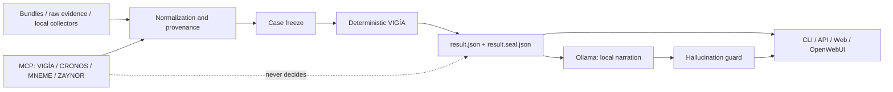

# ZAYNOR — local, deterministic, traceable DFIR investigation

*[Leer en español](./README.md)*

[](https://github.com/annatchijova/zaynor/actions/workflows/ci.yml)
[](./pyproject.toml)
[](https://docs.astral.sh/ruff/)
[](https://black.readthedocs.io/)
[](./LICENSE)
[](https://www.conventionalcommits.org/en/v1.0.0/)
[](./CHANGELOG.md)
[](https://semver.org/spec/v2.0.0.html)

ZAYNOR is a local AI-assisted forensic investigation platform that separates
investigative autonomy from authority over conclusions.

It can ingest forensic bundles and raw evidence, work with postmortem evidence,
or receive observations from bounded local collectors such as Velociraptor.
Evidence is normalized, frozen, and analyzed by the deterministic mathematical
engine of [VIGÍA](https://github.com/annatchijova/vigia-intent-analysis) before
an authoritative sealed result is produced.

After analysis, local Ollama models may explain the case, formulate
discriminating questions, and propose read-only queries. The model cannot write
or modify the verdict: new evidence must return to the deterministic pipeline.

The case can be processed locally. ZAYNOR exposes a CLI, OpenAI-compatible API,
web interface, and MCP integrations for local analysis tools and assistants.

**[Try ZAYNOR on Vercel](https://zaynor-demo.vercel.app) · [Reproduce a case](#reproducible-nitroba-case) · [ZAYNOR architecture](https://annatchijova.github.io/zaynor/architecture.html) · [VIGÍA mathematical decisions](https://annatchijova.github.io/vigia/vigia_diagrams.html) · [Install](./INSTALL.md)**

[](https://annatchijova.github.io/zaynor/architecture.html)

*Interactive diagram — [explore it live](https://annatchijova.github.io/zaynor/architecture.html), with guided views for the authority path, bounded investigation, and analyst audience.*

## The problem

DFIR investigations combine logs, memory, filesystem, network, browser
artifacts, tickets, and operator notes. Sources may be incomplete,
contradictory, or controlled by an attacker. Manual correlation is slow;
delegating the conclusion to an LLM is unsafe.

ZAYNOR addresses this with two explicit separations:

1. **Acquisition and investigation can be flexible.** Bundles, raw evidence,
   postmortem replays, and bounded local collectors are supported.
2. **The conclusion is deterministic.** The result is produced by VIGÍA over a
   frozen case and cryptographically bound to its evidence.

Local AI helps investigate and explain. It does not calculate, replace, or
negotiate the verdict.

## What makes ZAYNOR different

- It is not a chatbot that decides: the LLM narrates or proposes bounded
  queries only after the authoritative result is verified.
- It is not a SIEM or EDR: local lab acquisition can be received, but
  collectors produce evidence and do not assign verdicts during collection.
- It is not only a VIGÍA wrapper: it adds ingestion contracts, freeze, sealed
  results, a hash-chained audit trail with timestamps included in hashed
  entries, a report custody chain with deterministic `result_sha256` and a
  timestamped `report_hash`, safe narration, API, CLI, web, and capability
  boundaries.
- Memory is not authority: CRONOS and MNEME may provide auxiliary traces,
  memory, or custody, but do not replace verification of `result.json` and
  `result.seal.json`.
- It is reproducible: the same frozen case and configuration produce the same
  result whether chat is enabled or not.

## Authority flow



`result.json` together with `result.seal.json` remains authoritative. The UI,
Ollama, and MCP cannot mutate them. New evidence must be frozen and analyzed by
the deterministic engine again.

## Data and dataset

ZAYNOR supports forensic bundles, raw evidence, postmortem evidence, bounded
Velociraptor acquisition, local AIOps/OTel observations, and reproducible case
replays.

Evaluation uses the reusable
[VIGÍA Intent Analysis corpus](https://github.com/annatchijova/vigia-intent-analysis).
It includes malicious, real and publicly documented, benign, false-positive,
false-negative, adversarial, and BREAK cases. The corpus uses public and
authorized sources including [Digital Corpora](https://digitalcorpora.org/)
and SANS forensic material, alongside the canonical intentionality corpus.

Synthetic fixtures in this repository support deterministic demos and
regression tests; they are not the only evaluation source.

## Interfaces

- **CLI:** acquire or import evidence, freeze cases, analyze, verify seals,
  query results, and generate reports.
- **OpenAI-compatible API:** `zaynor serve` exposes the local API for tools and
  OpenWebUI.
- **Web:** visual case catalog, MD/HTML/PDF reports, junior and senior views,
  audit, MITRE/NIST context, and investigation flow.
- **OpenWebUI:** connects to the ZAYNOR API; it does not bypass the authority
  boundary or connect the forensic chat directly to an external provider.
- **MCP:** three local servers — VIGÍA, CRONOS, and MNEME — plus ZAYNOR's own
  MCP server. Tools are bounded by capability, role, and resource.

The chat path is:

```text
OpenWebUI → ZAYNOR API → verified sealed result → local Ollama → guard → safe response
```

MCP details: [`docs/mcp-locales.md`](./docs/mcp-locales.md).

## Ollama and agents

Generative inference uses Ollama or another compatible local backend, with host,
model, and timeout configurable. Freeze, analysis, sealing, and verification do
not require an LLM.

MENTOR explains sealed results; INVESTIGATOR proposes read-only investigation;
FLEET_COMMANDER records hypotheses and tasks; DETECTION_ENGINEER prepares
candidates; and DFIR collectors produce evidence and provenance. No agent
assigns the verdict.

## Quick start

```bash
git clone https://github.com/annatchijova/zaynor.git
cd zaynor
python3 -m venv .venv
source .venv/bin/activate
pip install -e ".[api]"

zaynor analyze --help
zaynor chat --help
zaynor serve --output-root ./outputs --cases-root ./casos --port 8420
```

Full installation, Ollama, Velociraptor, OpenWebUI, and lab instructions:

- [`INSTALL.md`](./INSTALL.md)
- [`GUIA_PERITOS.md`](./GUIA_PERITOS.md)
- [`docs/demo-lab/README.md`](./docs/demo-lab/README.md)

## Cases and reports

The catalog includes real, adversarial, BREAK, benign, and reproducible fixture
cases. Nitroba includes its artifacts and downloadable MD, HTML, and PDF
reports.

- [`casos/README.md`](./casos/README.md) — case corpus and provenance.
- [`results/`](./results/) — generated results and reports.
- [`frontend/`](./frontend/) — visual interface and public replay.
- [`docs/architecture-for-frontend.md`](./docs/architecture-for-frontend.md) — view contract.

## Red team and validation

The repository contains 27 numbered or related red-team round documents
covering authority boundaries, the CLI, path traversal, TOCTOU, seals, MCP,
Ollama, OpenWebUI, prompt injection, and agent contracts.

Backend: `PYTHONPATH=src pytest -q --ignore=tests/test_real_forensic_image_evidence.py`
produces `416 passed, 1 skipped` (the one excluded test is a preexisting,
documented hang under separate investigation — not counted as passed).
Frontend: `npm test` in `frontend/` produces `19 passed`. No run is
presented as green if it wasn't: a failing test gets documented, not
silently excluded.

- [Unified security audit](./docs/red-team/2026-09-17-unified-audit.md)
- [Backend round resolution](./docs/red-team/2026-09-17-round-22-resolution.md)
- [Architecture audit resolution](./docs/red-team/2026-09-17-round-23-architecture-audit-resolution.md)
- [Ollama/OpenWebUI audit](./docs/red-team/2026-09-16-round-15-ollama-openwebui.md)
- [Round 21 resolution](./docs/red-team/2026-09-17-round-21-resolution.md)
- [Test suite](./tests/)

## Security and limits

Security does not depend on model obedience. The result is cryptographically
verified before narration; contradictory claims are rejected or removed; and
evidence controlled by a possible adversary remains data, unable to expand
capabilities or write authoritative state.

ZAYNOR does not claim to replace a continuous SIEM or EDR or to perform
autonomous remediation. External threat-intelligence integrations are optional
and are not part of the default local runtime.

Report vulnerabilities privately according to [`SEGURIDAD.md`](./SEGURIDAD.md).

## Selected documentation

- [`docs/technical-details.md`](./docs/technical-details.md)
- [`docs/mcp-locales.md`](./docs/mcp-locales.md)
- [`AGENTS.md`](./AGENTS.md)
- [`docs/architecture.html`](./docs/architecture.html)
- [`LIMITACIONES_CONOCIDAS.md`](./LIMITACIONES_CONOCIDAS.md)
- [`AUTHORS.md`](./AUTHORS.md)
- [`CONTRIBUTING.md`](./CONTRIBUTING.md)

## ZAYNOR technical surface

```text
ZAYNOR
├── Deterministic forensic authority
│   └── VIGÍA
│       ├── abductive and inductive reasoning
│       ├── likelihood + ENFSI
│       ├── causal closure and graph stability
│       ├── risk-bounded decision
│       ├── quadripartite verdict
│       ├── exact arithmetic
│       └── deterministic scoring
│
├── Forensic acquisition and analysis
│   ├── Velociraptor
│   ├── memory, disk, and network
│   ├── MFT, Prefetch, Registry, and Shellbags
│   ├── PCAP
│   ├── browser, Android, iOS, and macOS
│   ├── timeline reconstruction
│   └── artifact normalization
│
├── Evidence integrity
│   ├── freeze and canonicalization
│   ├── provenance
│   ├── SHA-256 seals
│   ├── case-bound audit hash chain
│   ├── timestamps in hashed entries
│   ├── optional HMAC
│   ├── custody verification
│   └── deterministic replay
│
├── Agentic investigation
│   ├── Ollama
│   ├── capability policy: READ / DERIVE / ACQUIRE / MUTATE / AUTHORIZE
│   ├── MENTOR
│   ├── INVESTIGATOR
│   ├── DISPATCHER
│   ├── DETECTION_ENGINEER
│   └── hallucination and authority guards
│
├── MCP
│   ├── VIGÍA
│   ├── CRONOS
│   ├── MNEME
│   └── ZAYNOR MCP
│
├── Observability and LIVE laboratory
│   ├── OpenTelemetry
│   ├── Prometheus
│   ├── Loki
│   ├── Tempo
│   └── Grafana
│
├── Interfaces
│   ├── CLI
│   ├── OpenAI-compatible API
│   ├── OpenWebUI
│   ├── Web UI
│   └── MD / HTML / PDF reports
│
└── Verification
    ├── test suite
    ├── adversarial corpus
    ├── Red Team rounds
    ├── determinism tests
    ├── authority-boundary tests
    └── reproducible forensic cases
```

### Main stack and dependencies

```text
Python 3.12
├── ZAYNOR
│   ├── vendored VIGÍA engine
│   ├── Ollama
│   ├── MCP
│   ├── Velociraptor
│   └── ReportLab / reporting
├── DFIR
│   └── SIFT-style analysis modules
└── Observability
    └── OpenTelemetry → Prometheus / Loki / Tempo / Grafana

Frontend
└── Next.js / TypeScript → ZAYNOR API
```

The physical tree includes source code, cases, tests, documentation, and
generated artifacts. `build/`, caches, and installed dependencies are not part
of the documented source surface.

## Visual evidence from a CLI run

These screenshots document a reproducible local run of
`case_026_ventrilocuo_process_hollowing`:

- [Freeze and analysis](./visual/Screenshot%20from%202026-09-18%2004-20-42.png)
- [Authoritative result and seal](./visual/Screenshot%20from%202026-09-18%2004-20-44.png)
- [Audit trail with valid chain](./visual/Screenshot%20from%202026-09-18%2004-22-41.png)
- [Local chat and authority guard](./visual/Screenshot%20from%202026-09-18%2004-26-12.png)

The important points:

- freeze completed correctly;
- VIGÍA produced `MALICE`;
- audit: `overall: VERIFIED`;
- valid audit trail: `chain_valid: true`;
- result and seal verified;
- the model attempted to introduce `UNKNOWN` as a verdict/confidence claim;
- the hallucination guard detected it:
  - `claims_total: 4`;
  - `claims_verified: 3`;
  - `claims_hallucinated: 1`;
  - `suspicious: true`;
  - rejected claim: `UNKNOWN`.

The authoritative verdict remained `MALICE`.

`confidence: UNKNOWN` in the audit does not mean that verification failed: it
is a result field that was not calculated or supplied for this fixture.
`provenance: EMPTY` is also a characteristic of this fixture, not an
integrity failure.

The visible demo sequence is:

```text
VIGÍA: MALICE
AUDIT: VERIFIED
CHAIN: VALID
MODEL CLAIM: UNKNOWN
GUARD: REJECTED
AUTHORITATIVE VERDICT: MALICE
```

This demonstrates that the LLM can narrate incorrectly, but cannot change the
authoritative result.

## License

Apache License 2.0. See [`LICENSE`](./LICENSE).
