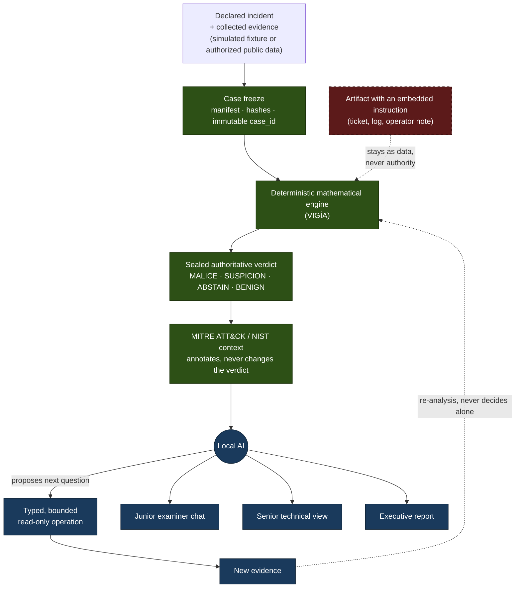

# Zaynor — local, traceable DFIR investigation

[](https://github.com/annatchijova/zaynor/actions/workflows/ci.yml)
[](./pyproject.toml)
[](https://docs.astral.sh/ruff/)
[](https://black.readthedocs.io/)
[](https://www.conventionalcommits.org/en/v1.0.0/)
[](./CHANGELOG.md)
[](https://semver.org/spec/v2.0.0.html)

*[Leer en español](./README.md)*

**[Published architecture diagram (HTML)](https://annatchijova.github.io/zaynor/architecture.html)**

## The real problem

After an incident, an investigator must reconstruct what happened from
authentication, process, network, filesystem, ticket, and operator-note
records. The sources may be incomplete, contradictory, or contain text
controlled by an attacker. Manual correlation is slow. A generic LLM assistant
may be fast, but it can also invent facts, overstate causality, or treat a
sentence inside a log as an instruction.

Zaynor addresses one concrete question:

> What does the evidence support, which alternative explanations were
> considered, what should be investigated next, and what remains unknown?

Zaynor is not a SIEM, an EDR, or a real-time monitoring system. It is a local,
post-incident DFIR investigation tool.

## What it does

Zaynor receives an already-declared incident and already-collected evidence. It
freezes the case, preserves artifact identity, and passes the evidence to a
deterministic mathematical engine. That engine produces and seals the
authoritative result using one of these public labels:

```text
MALICE | ABSTAIN | UNKNOWN | BENIGN | SUSPICION
```

AI does not detect the incident or decide the verdict. After the result is
sealed, a local LLM may decide what to investigate next, propose a bounded
read-only operation, and explain the result for different audiences. If a
query produces new evidence, that evidence passes through the mathematical
engine again before it can change an authoritative result.

The architectural principle is:

> **AI decides what to investigate. The deterministic mathematical engine
decides what the evidence supports.**

The quadripartite engine in the VIGÍA lineage exists as a technical capability.
Its detailed mechanics, score, and internal semantics are a later technical
deep dive; this README prioritizes the authority boundary that the jury can
observe in the demo.

## Authority flow



The AI (blue) never writes into the authoritative path (green); the
adversarial artifact (red, dashed) enters as evidence to be read, never as
an instruction crossing into the deterministic engine.

The AI can never:

- write directly to the verdict or sealed result;
- create evidence references that no real tool returned;
- execute a shell, arbitrary network request, or filesystem write;
- turn ambiguity into a confident conclusion;
- execute a defensive recommendation.

An instruction written inside a log, ticket, or artifact remains **untrusted
evidence**, never a system command.

## Audiences

### Junior forensic examiner (perito junior)

The perito junior has a full local-LLM chat for asking questions about the case
in natural language. The chat explains:

1. what was observed;
2. why it matters;
3. which evidence supports each explanation;
4. which alternatives were considered;
5. what should be queried next;
6. what remains unknown.

The chat helps investigate and understand the case. It is not a second verdict
engine and cannot execute remediation.

### Senior analyst

The technical view preserves frozen artifacts, provenance, timeline, fractures,
hypotheses, evidence references, verdict state, MITRE/NIST context, audit data,
and open questions.

### Incident owner

The executive view summarizes the sealed result, supported sequence, material
uncertainty, framework context, and proposed defensive actions. Actions are
shown as `PROPOSED` and `NOT EXECUTED`.

## Demonstration case

The demo uses `INC-2026-DEMO-001`, a simulated Linux incident:

```text
privileged login from an unknown device
    -> SSH session on srv-files-01
    -> process creates collection.zip
    -> timestamp metadata is changed
    -> related outbound connection is observed
    -> operator note attempts to manipulate the investigator
```

The system must show both what it can establish and what it cannot. The
identity of the person at the keyboard, the credential origin, and the
complete transfer of the file remain unknown unless the frozen evidence
supports them.

A synthetic fixture or replay may put an already-formed case on screen. It is
a demonstration harness, not a claim that Zaynor is live monitoring or a
production SIEM.

## Three-minute demonstration

The recommended jury explanation is:

1. **Problem:** evidence is scattered, contradictory, and potentially
   manipulative.
2. **Sealed verdict:** the deterministic engine produces a public label before
   the LLM is called.
3. **Investigation:** the local LLM selects a discriminating question and can
   use only read-only tools.
4. **Manipulation:** an artifact contains an instruction; it is recorded as
   untrusted data and cannot change permissions, tools, or the verdict.
5. **Explanation:** the perito junior asks the local chat about the result and
   what remains to be investigated.
6. **Close:** supported facts, uncertainty, MITRE/NIST context, and proposed
   actions are shown separately.

> **AI investigates. Evidence and the deterministic engine decide.**

## How to run it

Zaynor integrates VIGÍA's deterministic mathematical engine, vendored
inside this same repository (`vendor/vigia_engine/`), instead of
reimplementing it — an architectural decision, not an oversight (see
"Design lineage" below). **One `git clone` is enough**: no second
repository to clone or install for `analyze`/`audit` to work.

```bash
# 1. Clone.
git clone https://github.com/annatchijova/zaynor.git
cd zaynor

# 2. Install (requires Python >=3.12).
python3 -m venv .venv && source .venv/bin/activate
pip install -e .

# 3. Try Zaynor's own pipeline (replay/detect/case).
zaynor case --fixture scenarios/inc-2026-demo-001/telemetry.jsonl --json

# 4. Freeze, analyze, and audit a case — all local, no external dependencies.
zaynor freeze --case-id CASE-001 --evidence-profile admin-session-investigation \
  --profile-map scenarios/inc-2026-demo-001/evidence_profile.json \
  --source-root scenarios/inc-2026-demo-001 --cases-root ./cases

zaynor analyze --case-id CASE-001 --cases-root ./cases --output-root ./outputs

zaynor audit --case-id CASE-001 --cases-root ./cases --output-root ./outputs
```

`--engine-repo` still exists for anyone who wants to point at their own
VIGÍA checkout (developing against VIGÍA itself, or a newer engine
version) — an override, not a requirement.

## Development (SDLC)

Commits use [Conventional Commits](https://www.conventionalcommits.org/en/v1.0.0/)
(enforced by `scripts/commitlint.py` as the `commit-msg` hook);
releases follow [SemVer](https://semver.org/spec/v2.0.0.html) with a
[Keep a Changelog](./CHANGELOG.md); lint with
[`ruff`](https://docs.astral.sh/ruff/) (format/type badges are informational
until the tree converges: see [`CONTRIBUTING.md`](./CONTRIBUTING.md)).
See [`CONTRIBUTING.md`](./CONTRIBUTING.md) for the full workflow.

Docs-sync gate (`scripts/docs_check.py`): a code change that a document
contracts (CLI, API, agents, the VIGÍA adapter, the seal, MCP, frontend,
SDLC — the map is the script's `DOCS_MAP`) must update that document in the
same branch. Enforced mechanically by the `pre-push` hook and the CI
`docs-sync` job; deliberate per-rule exemptions via the commit trailer
`Docs-Waiver: <rule-id> <reason>`.

## Requirements and sovereignty

- All processing runs locally.
- Inference uses Ollama or an equivalent local backend.
- Case data is never sent to an external service.
- Only simulated or authorized public data is used.
- The model operates through explicit read-only operations with step, time,
  byte, and result limits.
- No testing is performed against real systems.

## Status and scope

The repository is integrating existing capabilities rather than building a
platform from scratch. The current tree includes, among other pieces: case
freezing with a dual hash (one deterministic over content, one folding in the
sealing timestamp); two hash-chained audit trails with an optional HMAC
anchor; the real VIGÍA Mode 1 executor (a real subprocess, not simulated); a
local MCP client to VIGÍA's bridge; the MITRE ATT&CK → D3FEND enrichment
engine (pure annotation, never authoritative); candidate Sigma rule
generation (always marked `experimental`, never deployable without human
review); a matrix of proposed response actions (`PROPOSED`, never executed);
the investigation log adapted from ANNACONDA; and the synthetic demonstration
scenario.

### Local agents (Ollama), by role

`agents/` defines eight roles with explicit capability contracts
(`READ`/`DERIVE`/`ACQUIRE`/`MUTATE`/`AUTHORIZE`), verified by manifest hash.
Their real status, not an aspirational one:

| Role | Status | What it actually does |
|------|--------|------------------------|
| MENTOR | wired | Explains an already-sealed result — reads `ZaynorAuthoritativeResult`, never calls VIGÍA again. |
| INVESTIGATOR | wired | `collect_window`/`verify_custody` genuinely call VIGÍA's real MCP bridge (`read_evidence`/`generate_forensic_hash`); the rest reuses the same read-only view MENTOR uses. |
| FLEET_COMMANDER | wired | Writes to the investigation log (hypotheses, tasking, escalation) — never produces a verdict or triggers an autonomous loop. |
| DETECTION_ENGINEER | wired | `draft_sigma_rule` generates Sigma candidates grounded in a real finding from the sealed result. |
| DISPATCHER | wired | A catalog of the evidence types Mode 1 can actually analyze (registry, prefetch, browser, event log, memory, MFT, EBS-JSON). |
| ENDPOINT_HUNTER / PERSISTENCE_HUNTER | out of scope | Would require a live collection backend (EDR-style) this project does not have and does not intend to build — VIGÍA analyzes already-frozen evidence, not live telemetry. |
| THREAT_INTEL | out of scope, for now | A portable implementation exists (VirusTotal/GTI enrichment with honest no-key degradation), evaluated but not yet wired in: it implies an external network dependency, a pending product decision. |

The final integration must preserve these properties:

- the same frozen case and configuration produce the same authoritative result;
- enabling or disabling the LLM does not change the sealed result;
- every finding has traceable references;
- invented references are rejected;
- path traversal, unauthorized tools, and writes are rejected;
- an adversarial artifact cannot modify authority state;
- missing or ambiguous evidence remains `UNKNOWN`;
- comprehensive MITRE and NIST context does not promote a finding;
- the perito junior chat explains authorized facts only.

## Out of current scope

The current demonstration does not include:

- real-time monitoring or collection;
- acquisition from real systems;
- autonomous remediation;
- shell, arbitrary network, or write access for the LLM;
- PDF or HTML rendering;
- a SIEM, EDR, or operational-scale product.

Real-time monitoring, new report formats, and operational connectors are later
improvements. The full local chat and comprehensive MITRE/NIST context are part
of the product being integrated now.

## Documentation

- [`docs/extra_arenaai.md`](./docs/extra_arenaai.md) — formal product
  position, users, demo, scope, and acceptance criteria.
- [`AGENTS.md`](./AGENTS.md) — VIGÍA integration contracts and authority limits
  between evidence, deterministic engine, and LLM.
- [`docs/proposal.en.md`](./docs/proposal.en.md) — architecture proposal.
- [`docs/implementation-plan.en.md`](./docs/implementation-plan.en.md) —
  integration plan and capability matrix.
- [`docs/hackathon/`](./docs/hackathon/) — Hackathon CyberAr rules, challenge
  material, and research notes.
- [`docs/SANDBOX.md`](./docs/SANDBOX.md) — evidence-worker boundaries.
- [`docs/red-team/`](./docs/red-team/) — adversarial audit rounds (Claude
  and Codex auditing each other), with findings confirmed by induction, not
  just by reading code.

## Design lineage

See [`docs/design-references.en.md`](./docs/design-references.en.md).

## License

Apache License 2.0 — see [`LICENSE`](./LICENSE).
