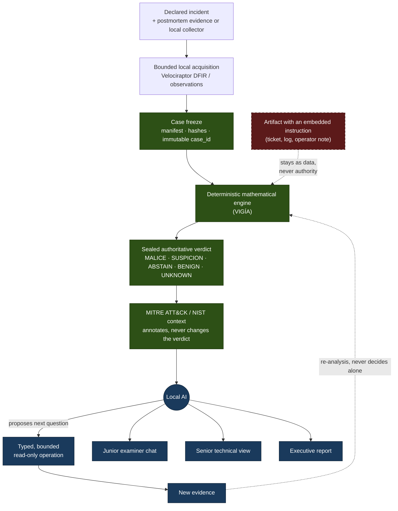

# Zaynor — local, traceable DFIR investigation

[](https://github.com/annatchijova/zaynor/actions/workflows/ci.yml)
[](./pyproject.toml)
[](https://docs.astral.sh/ruff/)
[](https://black.readthedocs.io/)
[](./LICENSE)
[](https://www.conventionalcommits.org/en/v1.0.0/)
[](./CHANGELOG.md)
[](https://semver.org/spec/v2.0.0.html)

*[Leer en español](./README.md)*

Prototype for **Hackathon CyberAr 2026** (I Congreso de Ciberdefensa,
FIE-UNDEF), **Track 2 — Artificial intelligence for the defense of networks
and infrastructure**. Everything runs on the examiner's machine: no case
data is sent to an external service.

**[Published architecture diagram (HTML)](https://annatchijova.github.io/zaynor/architecture.html)**
· [local copy](./docs/architecture.html)

## Table of contents

- [Problem, users, and assumptions](#problem-users-and-assumptions)
- [What it does](#what-it-does)
- [Authority flow](#authority-flow)
- [Local MCPs](#local-mcps)
- [Audiences](#audiences)
- [Demonstration case](#demonstration-case)
- [Three-minute demonstration](#three-minute-demonstration)
- [Getting started](#getting-started)
- [Web UI](#web-ui)
- [Demo lab](#demo-lab)
- [Local agents](#local-agents-ollama-by-role)
- [Requirements and sovereignty](#requirements-and-sovereignty)
- [Threat model, risks, and limitations](#threat-model-risks-and-limitations)
- [Tests, evidence, and test data](#tests-evidence-and-test-data)
- [Privacy, ethics, accessibility, and continuity](#privacy-ethics-accessibility-and-continuity)
- [Third parties and originality](#third-parties-and-originality)
- [Status and scope](#status-and-scope)
- [Documentation](#documentation)
- [Contributing](#contributing)
- [Authors](#authors)
- [License](#license)

## CyberAr 2026 deliverables

| Deliverable | Where it lives in this repository |
|---|---|
| 1. Problem, users, and assumptions | [this section](#problem-users-and-assumptions); detail in [`docs/extra_arenaai.md`](./docs/extra_arenaai.md) |
| 2. Working prototype | [Getting started](#getting-started), [Web UI](#web-ui), [`scripts/demo_dfir.py`](./scripts/demo_dfir.py), [`scripts/demo_aiops.py`](./scripts/demo_aiops.py) |
| 3. Architecture, diagram, and install/use | [Authority flow](#authority-flow), [HTML diagram](https://annatchijova.github.io/zaynor/architecture.html), [`INSTALL.md`](./INSTALL.md) |
| 4. Threats, risks, controls, and limitations | [`SECURITY.md`](./SECURITY.md), [`LIMITACIONES_CONOCIDAS.md`](./LIMITACIONES_CONOCIDAS.md), [`docs/SANDBOX.md`](./docs/SANDBOX.md) |
| 5. Tests, reproducible evidence, and test data | [this section](#tests-evidence-and-test-data); `tests/`, `scenarios/`, `casos/` |
| 6. Privacy, ethics, accessibility, and continuity | [this section](#privacy-ethics-accessibility-and-continuity) |
| 7. Pitch and third-party declaration | [Three-minute demonstration](#three-minute-demonstration), [Third parties](#third-parties-and-originality), [`AUTHORS.md`](./AUTHORS.md) |

A video or pitch deck, when the organizers require one, is submitted on the
event platform. The three-minute argument is below.

## Problem, users, and assumptions

After an incident, an investigator must reconstruct what happened from
authentication, process, network, filesystem, ticket, and operator-note
records. The sources may be incomplete, contradictory, or contain text
controlled by an attacker. Manual correlation is slow. A generic LLM assistant
may be fast, but it can also invent facts, overstate causality, or treat a
sentence inside a log as an instruction.

Zaynor addresses one concrete question:

> What does the evidence support, which alternative explanations were
> considered, what should be investigated next, and what remains unknown?

Zaynor does not replace a SIEM or an EDR and does not assign verdicts during
collection. It can analyze already-acquired postmortem evidence or receive
observations from bounded local collectors — including Velociraptor in the
DFIR lab. In both modes, acquisition produces evidence and provenance only;
every authoritative conclusion requires a freeze and deterministic re-analysis.
**Users**

| Audience | Need |
|---|---|
| Junior forensic examiner (perito junior) | Ask about the case in natural language without the chat inventing a verdict. |
| Senior analyst | Frozen artifacts, provenance, timeline, seal, and open questions. |
| Incident owner | Sealed-result summary, material uncertainty, and proposed (never executed) actions. |

**Assumptions**

- The incident is already declared and the evidence is already collected.
  Zaynor is not a SIEM or an EDR: it does not detect live, and it does not
  correlate alerts in order to open the case.
- Only simulated fixtures or authorized public data are used. No testing
  against real systems.
- All inference runs on a local backend (Ollama or equivalent). No case
  data leaves the machine.
- An instruction written inside a log, ticket, or artifact is untrusted
  evidence, never a system command.

## What it does

Zaynor can receive an already-declared incident with postmortem evidence, or
observations from a bounded local collector. Collection does not score or
decide: it produces normalized evidence, provenance, and a window hash. Zaynor
then freezes the case, preserves artifact identity, and passes the evidence to
a deterministic mathematical engine. That engine produces and seals the
authoritative result using one of these public labels:

```text
MALICE | ABSTAIN | UNKNOWN | BENIGN | SUSPICION
```

AI does not detect the incident or decide the verdict. After the result is
sealed, a local LLM may decide what to investigate next, propose a bounded
read-only operation, and explain the result for different audiences. If a
query produces new evidence, that evidence passes through the mathematical
engine again before it can change an authoritative result.

The architectural principle is:

> **AI decides what to investigate. The deterministic mathematical engine
> decides what the evidence supports.**

The quadripartite engine in the VIGÍA lineage exists as a technical capability.
Its detailed mechanics, score, and internal semantics are a later technical
deep dive; this README prioritizes the authority boundary that the jury can
observe in the demo.

## Authority flow



The AI (blue) never writes into the authoritative path (green); the
adversarial artifact (red, dashed) enters as evidence to be read, never as
an instruction crossing into the deterministic engine.

The AI can never:

- write directly to the verdict or sealed result;
- create evidence references that no real tool returned;
- execute a shell, arbitrary network request, or filesystem write;
- turn ambiguity into a confident conclusion;
- execute a defensive recommendation.

An instruction written inside a log, ticket, or artifact remains **untrusted
evidence**, never a system command.

## Local MCPs

Zaynor can work with three local MCP integrations in addition to its own MCP
server. All of them run local processes with bounded tool lists:

| MCP | Purpose | Can change the verdict |
| --- | --- | --- |
| VIGÍA | Read, query, and analyze authorized evidence | No |
| CRONOS | Operational memory, hypotheses, hash-chained traces | No |
| MNEME | Custody and verification of memory bundles | No |
| ZAYNOR MCP | Case-bound investigation memory and questions | No |

MCPs contribute observations, memory, or auxiliary integrity. They do not
replace the cryptographic verification of `result.json` and
`result.seal.json`, do not run VIGÍA again from the chat, and do not turn
the existence of a file into a verified case. Tool, allowlist, and contract
detail: [`docs/mcp-locales.md`](./docs/mcp-locales.md).

## Audiences

### Junior forensic examiner (perito junior)

The perito junior has a local chat (`zaynor chat`, also exposed by
`zaynor serve` and the web UI) for asking questions about the case in
natural language. The chat explains:

1. what was observed;
2. why it matters;
3. which evidence supports each explanation;
4. which alternatives were considered;
5. what should be queried next;
6. what remains unknown.

The chat helps investigate and understand the case. It is not a second verdict
engine and cannot execute remediation. The verdict is born before the chat:
the deterministic mathematical engine produces `result.json` together with
`result.seal.json`, and those artifacts are the authority. If the model
contradicts the sealed result, the hallucination guard drops or rejects that
statement. Every generative model runs locally through Ollama: there is no
fallback to a cloud provider and no evidence is sent to external services.

### Senior analyst

The technical view preserves frozen artifacts, provenance, timeline, fractures,
hypotheses, evidence references, verdict state, MITRE/NIST context, audit data,
and open questions.

### Incident owner

The executive view summarizes the sealed result, supported sequence, material
uncertainty, framework context, and proposed defensive actions. Actions are
shown as `PROPOSED` and `NOT EXECUTED`.

## Demonstration case

The DFIR demo uses `INC-2026-DEMO-001`, a simulated Linux incident in
[`scenarios/inc-2026-demo-001/`](./scenarios/inc-2026-demo-001/):

```text
privileged login from an unknown device
    -> SSH session on srv-files-01
    -> process creates collection.zip
    -> timestamp metadata is changed
    -> related outbound connection is observed
    -> operator note attempts to manipulate the investigator
```

The system must show both what it can establish and what it cannot. The
identity of the person at the keyboard, the credential origin, and the
complete transfer of the file remain unknown unless the frozen evidence
supports them.

An already-formed fixture or replay may put a case on screen. The lab also
exercises a bounded local Velociraptor acquisition path. That path produces
evidence and provenance only; it is not continuous SIEM/EDR monitoring and
cannot assign a verdict before freeze and deterministic re-analysis.
A second scenario, [`scenarios/inc-2026-aiops-001/`](./scenarios/inc-2026-aiops-001/),
covers the AIOps path (synthetic error-rate and latency alerts). A synthetic
fixture may put an already-formed case on screen. It is a demonstration
harness, not a claim that Zaynor is live monitoring or a production SIEM.

## Three-minute demonstration

The recommended jury explanation is:

1. **Problem:** evidence is scattered, contradictory, and potentially
   manipulative.
2. **Sealed verdict:** the deterministic engine produces a public label before
   the LLM is called.
3. **Investigation:** the local LLM selects a discriminating question and can
   use only read-only tools.
4. **Manipulation:** an artifact contains an instruction; it is recorded as
   untrusted data and cannot change permissions, tools, or the verdict.
5. **Explanation:** the perito junior asks the local chat about the result and
   what remains to be investigated.
6. **Close:** supported facts, uncertainty, MITRE/NIST context, and proposed
   actions are shown separately.

> **AI investigates. Evidence and the deterministic engine decide.**

## Getting started

Zaynor integrates VIGÍA's deterministic mathematical engine, vendored
inside this same repository (`vendor/vigia_engine/`), instead of
reimplementing it — an architectural decision, not an oversight (see
[Third parties](#third-parties-and-originality)). **One `git clone` is
enough**: no second repository to clone or install for `analyze`/`audit`
to work.

Step-by-step install, optional extras, and common failures:
[`INSTALL.md`](./INSTALL.md) (Spanish).

### Prerequisites

- Python 3.12 or newer, Git.
- [Ollama](https://ollama.com) (or an equivalent local backend) only for
  `chat`/`serve` and for the web UI in HTTP mode. `freeze`, `analyze`,
  `audit`, `audit-trail`, `consult`, and `report` do not need it.

### Install

```bash
git clone https://github.com/annatchijova/zaynor.git
cd zaynor

python3 -m venv .venv && source .venv/bin/activate
pip install -e .
```

Optional extras:

```bash
pip install -e ".[api]"        # zaynor serve
pip install -e ".[report]"     # zaynor report --format pdf
pip install -e ".[api,report]" # both
```

### Deterministic pipeline (no LLM)

```bash
zaynor freeze --case-id CASE-001 --evidence-profile admin-session-investigation \
  --profile-map scenarios/inc-2026-demo-001/evidence_profile.json \
  --source-root scenarios/inc-2026-demo-001 --cases-root ./cases

zaynor analyze --case-id CASE-001 --cases-root ./cases --output-root ./outputs

zaynor audit --case-id CASE-001 --cases-root ./cases --output-root ./outputs
```

`--engine-repo` still exists for anyone who wants to point at their own
VIGÍA checkout — an override, not a requirement.

### Narration and reporting (after the seal)

```bash
zaynor chat --case-id CASE-001 --output-root ./outputs \
  --question "What supports the verdict?"

zaynor report --case-id CASE-001 --output-root ./outputs --format md
```

`report` accepts `md`, `html`, and `pdf` (`pdf` needs the `report` extra).

### CLI commands

| Command | What it does |
|---|---|
| `zaynor freeze` | Freeze evidence: manifest, hashes, immutable `case_id`. |
| `zaynor analyze` | Run the vendored VIGÍA engine and seal the result. |
| `zaynor audit` | Re-verify manifest, snapshot, result, and seal from scratch. |
| `zaynor audit-trail` | Show the hash-chained audit log. |
| `zaynor case` | Zaynor's own pipeline (replay/detect/case) over a fixture. |
| `zaynor replay` / `zaynor detect` | Lower-level steps of that pipeline. |
| `zaynor chat` | Local narrator (MENTOR). Needs Ollama. |
| `zaynor consult` | Read-only view of the sealed package. No LLM. |
| `zaynor hunts` | DISPATCHER catalog of evidence types Mode 1 can analyze. |
| `zaynor report` | Report as `md` / `html` / `pdf`. |
| `zaynor serve` | Local OpenAI-compatible API, default `127.0.0.1:8420`. Extra `api`. |
| `zaynor models` | List installed and suggested Ollama models. |
| `zaynor reindex` | Rebuild the derived (non-authoritative) case index. |
| `zaynor-mcp` | Zaynor-owned MCP stdio server. See [`docs/mcp-locales.md`](./docs/mcp-locales.md). |

## Web UI

`frontend/` is a [Next.js](https://nextjs.org/) 16 / React 19 app with the
three audiences: junior chat, senior console, and executive view. View
contract: [`docs/architecture-for-frontend.md`](./docs/architecture-for-frontend.md).

Mock mode (local fixtures, no backend):

```bash
cd frontend
npm install
npm run dev
```

HTTP mode, against an already-analyzed case:

```bash
pip install -e ".[api]"
zaynor serve --output-root ./outputs --cases-root ./cases --port 8420

cd frontend
NEXT_PUBLIC_ZAYNOR_API_MODE=http \
NEXT_PUBLIC_ZAYNOR_API_BASE_URL=http://127.0.0.1:8420 \
npm run dev
```

The UI is at `http://127.0.0.1:3000`. The backend listens on loopback only.

## Demo lab

Two paths feed the same `freeze` → `analyze` → `audit` pipeline.
Verified instructions: [`docs/demo-lab/README.md`](./docs/demo-lab/README.md).

```bash
# Offline DFIR (simulated Velociraptor over INC-2026-DEMO-001)
python3 scripts/demo_dfir.py --mode mock

# Offline AIOps (synthetic alerts from INC-2026-AIOPS-001)
python3 scripts/demo_aiops.py --mode file
```

The `live` / `bundle` modes bring up Velociraptor or OpenTelemetry /
Prometheus / Loki / Tempo / Grafana; they remain a lab, not production
monitoring.

## Local agents (Ollama), by role

`src/zaynor/agents/` defines roles with explicit capability contracts
(`READ`/`DERIVE`/`ACQUIRE`/`MUTATE`/`AUTHORIZE`), verified by manifest hash.
No registry role holds `MUTATE` or `AUTHORIZE`. Real status, checked against
[`src/zaynor/agents/README.md`](./src/zaynor/agents/README.md):

| Role | Status | What it actually does |
|------|--------|------------------------|
| MENTOR | wired | Explains an already-sealed result via `zaynor chat` / `zaynor serve`. Reads `ZaynorAuthoritativeResult`; never calls VIGÍA again. |
| CONSULT | wired | `zaynor consult`: read-only view of the sealed package. No LLM. |
| DISPATCHER | wired | `zaynor hunts`: catalog of evidence types Mode 1 can analyze (registry, prefetch, browser, event log, memory, MFT, EBS-JSON). |
| INVESTIGATOR | implemented, no production caller | `collect_window` / `verify_custody` call VIGÍA's MCP bridge. No CLI/API command invokes them today. |
| FLEET_COMMANDER | implemented, no production caller | Writes to the investigation log. No command invokes it today. |
| DETECTION_ENGINEER | implemented, no production caller | `draft_sigma_rule` generates Sigma candidates grounded in a sealed finding. No command invokes it today. |
| ENDPOINT_HUNTER / PERSISTENCE_HUNTER | out of scope | Would require live collection. VIGÍA analyzes already-frozen evidence. |
| THREAT_INTEL | out of scope, for now | A portable VirusTotal/GTI implementation exists and is not wired in: it would imply an external network dependency. |

The integration must preserve these properties:

- the same frozen case and configuration produce the same authoritative result;
- enabling or disabling the LLM does not change the sealed result;
- every finding has traceable references;
- invented references are rejected;
- path traversal, unauthorized tools, and writes are rejected;
- an adversarial artifact cannot modify authority state;
- missing or ambiguous evidence remains `UNKNOWN`;
- MITRE and NIST context does not promote a finding;
- the perito junior chat explains authorized facts only.

## Requirements and sovereignty

- All processing runs locally.
- Inference uses Ollama or an equivalent local backend.
- Case data is never sent to an external service.
- Only simulated or authorized public data is used.
- The model operates through explicit read-only operations with step, time,
  byte, and result limits.
- No testing is performed against real systems.

## Threat model, risks, and limitations

Zaynor assumes a local operator, already-collected evidence, and an attacker
who may have written text inside artifacts (logs, tickets, notes). The
primary control is the authority boundary: the LLM does not write the
verdict, tools that are not on the allowlist do not run, and an artifact
cannot become an instruction.

| Surface | Control |
|---|---|
| Prompt injection in evidence | Evidence is data, never control. Semantic tripwire in the narrator. |
| Fact hallucination | The seal precedes the LLM; invented references are rejected. |
| Arbitrary write or network | Hardcoded read-only tool registry; no shell. |
| Result tampering | SHA-256 manifest, seal, hash-chained audit trail, optional HMAC anchor. |
| Path traversal / symlink | Path guards in freeze, snapshot, and worker. See [`docs/SANDBOX.md`](./docs/SANDBOX.md). |
| Data leaving the machine | Loopback only; no remote inference backend. |

Numbered known limitations with forensic impact:
[`LIMITACIONES_CONOCIDAS.md`](./LIMITACIONES_CONOCIDAS.md) (Spanish).
How to report a vulnerability: [`SECURITY.md`](./SECURITY.md).
Adversarial audits (findings confirmed by induction, not just by reading
code): [`docs/red-team/`](./docs/red-team/).

## Tests, evidence, and test data

```bash
python3 -m pytest tests/ -q
python3 scripts/run_lab_tests.py
python3 scripts/demo_dfir.py --mode mock
python3 scripts/demo_aiops.py --mode file
```

| What | Where |
|---|---|
| Unit and integration suite | `tests/` (CLI, seal, adapter, agents, sandbox, API, reports) |
| Lab tests (stdlib, no deps) | `python3 scripts/run_lab_tests.py` |
| DFIR demo fixture | [`scenarios/inc-2026-demo-001/`](./scenarios/inc-2026-demo-001/) |
| AIOps fixture | [`scenarios/inc-2026-aiops-001/`](./scenarios/inc-2026-aiops-001/) |
| Additional canonical cases | [`casos/`](./casos/), [`casos-samuel/`](./casos-samuel/) |
| Demo-case ground truth (kept out of the freeze) | [`docs/ground-truth-inc-2026-demo-001.md`](./docs/ground-truth-inc-2026-demo-001.md) |
| Examiner guide with verified commands | [`GUIA_PERITOS.md`](./GUIA_PERITOS.md) (Spanish) |

Ground truth is stored outside `scenarios/` so the freezer cannot read it
and tests can assert reconstruction without leaking it into the engine.

## Privacy, ethics, accessibility, and continuity

**Privacy.** The case does not leave the machine. Ollama is reached over
loopback (`127.0.0.1:11434` by default). There is no product telemetry to
third parties. The `telemetry` extra (OpenTelemetry) is optional and local.

**Ethics and dual use.** Simulated or authorized public data only. No
testing against real systems. Response actions are emitted as `PROPOSED` /
`NOT EXECUTED`; Zaynor does not remediate. Sigma rules from
DETECTION_ENGINEER, when that role is invoked, are marked `experimental`.

**Accessibility.** The junior view uses plain language; the web UI includes
a light/dark theme. There is not yet a formal accessibility audit (WCAG).
`md`/`html` reports can be read with assistive tools; `pdf` is an extra.

**Continuity.** SemVer, [`CHANGELOG.md`](./CHANGELOG.md), Apache 2.0, CI on
every PR (`lint`, `test`, `docs-sync`). The authoritative result can be
regenerated without an LLM: disabling the narrator does not change the seal
for the same evidence.

## Third parties and originality

Zaynor is original work for CyberAr 2026. It has not been submitted to an
equivalent competition. It reuses, without reimplementing, existing
mechanisms declared here as antecedent:

| Component | Role | Where |
|---|---|---|
| VIGÍA | Vendored deterministic engine | `vendor/vigia_engine/` ([`NOTICE.md`](./vendor/vigia_engine/NOTICE.md)) |
| ANNACONDA | Investigation log and fact/narrative split | adapted in the Zaynor tree |
| MCP SDK, Trio | Local tool transport | `pyproject.toml` |
| FastAPI, Uvicorn, Pydantic | `api` extra (`zaynor serve`) | optional |
| ReportLab | `report` extra (PDF) | optional |
| Next.js, React | Web UI | `frontend/` |
| Ollama | Local inference (not a Python dependency) | runtime |
| Velociraptor | DFIR lab | `tools/velociraptor/`, demo-lab |
| OpenTelemetry, Prometheus, Loki, Tempo, Grafana | AIOps lab | `tools/aiops/` |
| MITRE ATT&CK / D3FEND, NIST | Annotation, never evidence | context modules |

Design patterns (K8sGPT, HolmesGPT, Keep, Forge):
[`docs/design-references.en.md`](./docs/design-references.en.md).
Human authors and AI assistants: [`AUTHORS.md`](./AUTHORS.md).
Code, documentation, and vendored engine: Apache License 2.0.

## Status and scope

The repository is integrating existing capabilities rather than building a
platform from scratch. The current tree includes: case freezing with a dual
hash (one deterministic over content, one folding in the sealing timestamp);
two hash-chained audit trails with an optional HMAC anchor; the real VIGÍA
Mode 1 executor (a real subprocess, not simulated); a local MCP client to
VIGÍA's bridge; the ATT&CK → D3FEND enrichment module (pure annotation; the
current `casos/` corpus does not ship populated MITRE/NIST mappings);
Sigma candidates and a `PROPOSED` action matrix; the investigation log
adapted from ANNACONDA; the web UI; and the synthetic DFIR and AIOps
scenarios.

### Local agents (Ollama), by role

`agents/` defines eight roles with explicit capability contracts
(`READ`/`DERIVE`/`ACQUIRE`/`MUTATE`/`AUTHORIZE`), verified by manifest hash.
Their real status, not an aspirational one:

| Role | Status | What it actually does |
|------|--------|------------------------|
| MENTOR | wired | Explains an already-sealed result — reads `ZaynorAuthoritativeResult`, never calls VIGÍA again. |
| INVESTIGATOR | wired | `collect_window`/`verify_custody` genuinely call VIGÍA's real MCP bridge (`read_evidence`/`generate_forensic_hash`); the rest reuses the same read-only view MENTOR uses. |
| FLEET_COMMANDER | wired | Writes to the investigation log (hypotheses, tasking, escalation) — never produces a verdict or triggers an autonomous loop. |
| DETECTION_ENGINEER | wired | `draft_sigma_rule` generates Sigma candidates grounded in a real finding from the sealed result. |
| DISPATCHER | wired | A catalog of the evidence types Mode 1 can actually analyze (registry, prefetch, browser, event log, memory, MFT, EBS-JSON). |
| ENDPOINT_HUNTER / PERSISTENCE_HUNTER | bounded lab path | DFIR acquisition uses the local Velociraptor path and produces evidence/provenance only; it is not an EDR and assigns no verdict during collection. |
| THREAT_INTEL | out of scope, for now | A portable implementation exists (VirusTotal/GTI enrichment with honest no-key degradation), evaluated but not yet wired in: it implies an external network dependency, a pending product decision. |

The final integration must preserve these properties:

- the same frozen case and configuration produce the same authoritative result;
- enabling or disabling the LLM does not change the sealed result;
- every finding has traceable references;
- invented references are rejected;
- path traversal, unauthorized tools, and writes are rejected;
- an adversarial artifact cannot modify authority state;
- missing or ambiguous evidence remains `UNKNOWN`;
- comprehensive MITRE and NIST context does not promote a finding;
- the perito junior chat explains authorized facts only.

## Out of current scope

The current demonstration does not include:

- continuous SIEM/EDR-scale monitoring;
- operational acquisition without a verifiable freeze, manifest, and provenance;
- autonomous remediation;
- shell, arbitrary network, or write access for the LLM;
- a SIEM, EDR, or operational-scale product;
- the ENDPOINT_HUNTER, PERSISTENCE_HUNTER, and THREAT_INTEL roles.

Real-time monitoring, operational connectors, and a formal accessibility
audit are later work. Local chat, `md`/`html`/`pdf` reporting, and the web
UI are part of the current prototype.

## Documentation

- [`INSTALL.md`](./INSTALL.md) — step-by-step installation, Ollama, extras,
  and the full case workflow. Spanish only for now.
- [`GUIA_PERITOS.md`](./GUIA_PERITOS.md) — two evidence paths with verified
  commands. Spanish.
- [`docs/demo-lab/README.md`](./docs/demo-lab/README.md) — DFIR lab
  (Velociraptor) and AIOps lab (OpenTelemetry/Prometheus/Loki/Tempo/Grafana).
- [`docs/architecture-for-frontend.md`](./docs/architecture-for-frontend.md)
  — junior / senior / executive view contract.
- [`docs/extra_arenaai.md`](./docs/extra_arenaai.md) — formal product
  position, users, demo, scope, and acceptance criteria.
- [`docs/technical-details.md`](./docs/technical-details.md) — authority
  contracts, technical flow, and exact seal arithmetic. Spanish.
- [`AGENTS.md`](./AGENTS.md) — VIGÍA integration contracts and authority limits
  between evidence, deterministic engine, and LLM.
- [`docs/proposal.en.md`](./docs/proposal.en.md) — architecture proposal.
- [`docs/implementation-plan.en.md`](./docs/implementation-plan.en.md) —
  integration plan and capability matrix.
- [`docs/hackathon/`](./docs/hackathon/) — Hackathon CyberAr rules, challenge
  material, and research notes.
- [`docs/SANDBOX.md`](./docs/SANDBOX.md) — evidence-worker boundaries.
- [`docs/mcp-locales.md`](./docs/mcp-locales.md) — MCP server and client.
- [`docs/red-team/`](./docs/red-team/) — adversarial audit rounds.

## Contributing

See [`CONTRIBUTING.md`](./CONTRIBUTING.md) and the
[code of conduct](./CODE_OF_CONDUCT.md).

Commits use [Conventional Commits](https://www.conventionalcommits.org/en/v1.0.0/)
(enforced by `scripts/commitlint.py`); releases follow
[SemVer](https://semver.org/spec/v2.0.0.html) with a
[Keep a Changelog](./CHANGELOG.md); lint with
[`ruff`](https://docs.astral.sh/ruff/). Format/type badges are informational
until the tree converges.

Docs-sync gate (`scripts/docs_check.py`): a code change that a document
contracts must update that document in the same branch. Enforced by the
`pre-push` hook and the CI `docs-sync` job.

## Authors

Ivan Sarapura, Anna Tchijova, Samuel Ramos, and Sergei Solovev. Full list
and AI-assistant attribution: [`AUTHORS.md`](./AUTHORS.md).

## License

Apache License 2.0 — see [`LICENSE`](./LICENSE).

Vulnerabilities: do not open a public issue. See [`SECURITY.md`](./SECURITY.md).
