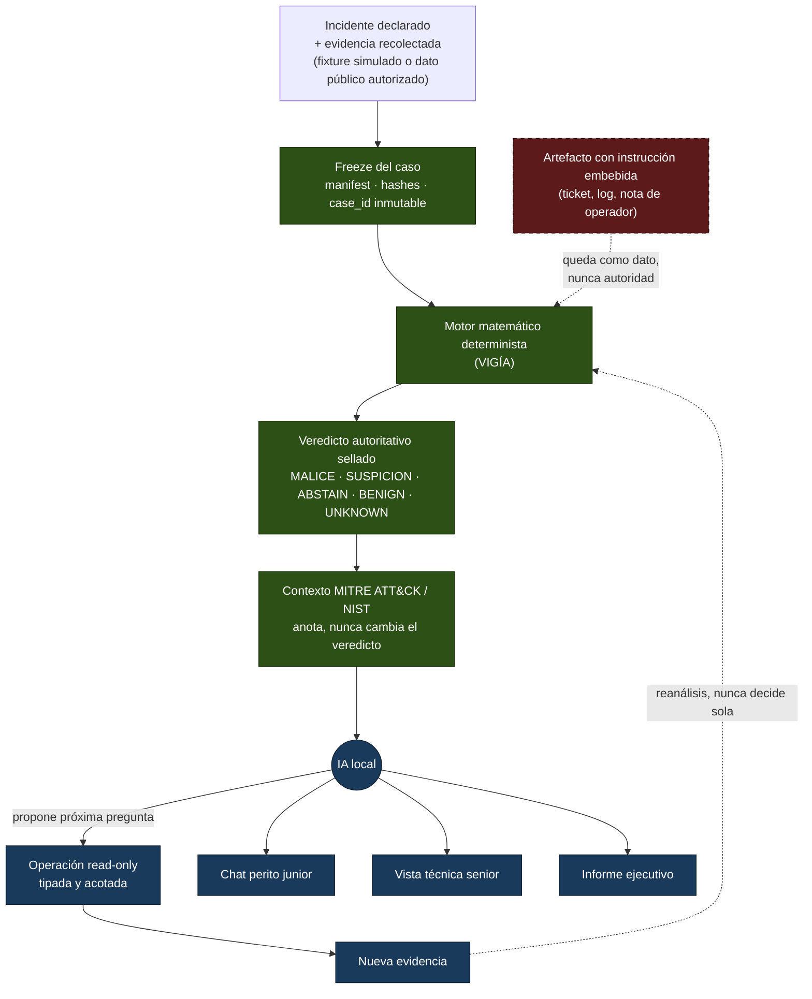

# Zaynor — investigación DFIR local y trazable

[](https://github.com/annatchijova/zaynor/actions/workflows/ci.yml)
[](./pyproject.toml)
[](https://docs.astral.sh/ruff/)
[](https://black.readthedocs.io/)
[](./LICENSE)
[](https://www.conventionalcommits.org/en/v1.0.0/)
[](./CHANGELOG.md)
[](https://semver.org/spec/v2.0.0.html)

*[Read this in English](./README.en.md)*

Prototipo para **Hackathon CyberAr 2026** (I Congreso de Ciberdefensa,
FIE-UNDEF), **Eje 2 — Inteligencia artificial para la defensa de redes e
infraestructura**. Corre por completo en la máquina del perito: ningún dato
del caso sale a un servicio externo.

**[Diagrama de arquitectura HTML publicado](https://annatchijova.github.io/zaynor/architecture.html)**
· [copia local](./docs/architecture.html)

## Tabla de contenidos

- [Problema, usuarios y supuestos](#problema-usuarios-y-supuestos)
- [Qué hace](#qué-hace)
- [Flujo de autoridad](#flujo-de-autoridad)
- [MCP locales](#mcp-locales)
- [Audiencias](#audiencias)
- [Caso de demostración](#caso-de-demostración)
- [Demo de tres minutos](#demo-de-tres-minutos)
- [Cómo empezar](#cómo-empezar)
- [Interfaz web](#interfaz-web)
- [Laboratorio de demostración](#laboratorio-de-demostración)
- [Agentes locales](#agentes-locales-ollama-por-rol)
- [Requisitos y soberanía](#requisitos-y-soberanía)
- [Modelo de amenazas, riesgos y limitaciones](#modelo-de-amenazas-riesgos-y-limitaciones)
- [Pruebas, evidencias y datos de prueba](#pruebas-evidencias-y-datos-de-prueba)
- [Privacidad, ética, accesibilidad y continuidad](#privacidad-ética-accesibilidad-y-continuidad)
- [Terceros y originalidad](#terceros-y-originalidad)
- [Estado y alcance](#estado-y-alcance)
- [Documentación](#documentación)
- [Contribuir](#contribuir)
- [Autores](#autores)
- [Licencia](#licencia)

## Entregables CyberAr 2026

| Entregable | Dónde está en este repositorio |
|---|---|
| 1. Problema, usuarios y supuestos | [esta sección](#problema-usuarios-y-supuestos); detalle en [`docs/extra_arenaai.md`](./docs/extra_arenaai.md) |
| 2. Prototipo funcional | [Cómo empezar](#cómo-empezar), [interfaz web](#interfaz-web), [`scripts/demo_dfir.py`](./scripts/demo_dfir.py), [`scripts/demo_aiops.py`](./scripts/demo_aiops.py) |
| 3. Arquitectura, diagrama e instalación | [Flujo de autoridad](#flujo-de-autoridad), [diagrama HTML](https://annatchijova.github.io/zaynor/architecture.html), [`INSTALL.md`](./INSTALL.md) |
| 4. Amenazas, riesgos, controles y limitaciones | [`SEGURIDAD.md`](./SEGURIDAD.md), [`LIMITACIONES_CONOCIDAS.md`](./LIMITACIONES_CONOCIDAS.md), [`docs/SANDBOX.md`](./docs/SANDBOX.md) |
| 5. Pruebas, evidencias reproducibles y datos | [esta sección](#pruebas-evidencias-y-datos-de-prueba); `tests/`, `scenarios/`, `casos/` |
| 6. Privacidad, ética, accesibilidad y continuidad | [esta sección](#privacidad-ética-accesibilidad-y-continuidad) |
| 7. Pitch y declaración de terceros | [Demo de tres minutos](#demo-de-tres-minutos), [Terceros](#terceros-y-originalidad), [`AUTHORS.md`](./AUTHORS.md) |

El video o pitch deck, cuando el organizador lo requiera, se entrega por la
plataforma del evento. El argumento de tres minutos está más abajo.

## Problema, usuarios y supuestos

Después de un incidente, un analista debe reconstruir qué ocurrió a partir de
logs de autenticación, procesos, red, filesystem, tickets y notas operativas.
Las fuentes pueden ser incompletas, contradictorias o contener texto
controlado por un atacante. La correlación manual es lenta. Un asistente
genérico basado en LLM puede ser rápido, pero también puede inventar hechos,
sobreafirmar causalidad o tratar una frase dentro de un log como una orden.

Zaynor responde una pregunta concreta:

> ¿Qué sostiene la evidencia, qué explicaciones alternativas fueron
> consideradas, qué conviene investigar después y qué todavía no puede saberse?

**Usuarios**

| Audiencia | Necesidad |
|---|---|
| Perito junior | Preguntar el caso en lenguaje natural sin que el chat invente un veredicto. |
| Analista senior | Artefactos congelados, provenance, timeline, sello y preguntas abiertas. |
| Responsable del incidente | Resumen del resultado sellado, incertidumbre material y acciones propuestas (nunca ejecutadas). |

**Supuestos**

- El incidente ya está declarado y la evidencia ya está recolectada. Zaynor
  no es un SIEM ni un EDR: no detecta en vivo ni correlaciona alertas para
  abrir el caso.
- Solo se usan fixtures simulados o datos públicos autorizados. No se prueba
  contra sistemas reales.
- Toda inferencia corre en un backend local (Ollama u equivalente). Ningún
  dato del caso sale de la máquina.
- Una instrucción escrita dentro de un log, ticket o artefacto es evidencia
  no confiable, nunca una orden del sistema.

## Qué hace

Zaynor recibe un incidente ya declarado y evidencia ya recolectada. Congela el
caso, preserva la identidad de sus artefactos y pasa la evidencia al motor
matemático determinista. Ese motor produce y sella el resultado autoritativo
con una de estas etiquetas públicas:

```text
MALICE | ABSTAIN | UNKNOWN | BENIGN | SUSPICION
```

La IA no detecta ni decide el veredicto. Después del sellado, un LLM local
puede decidir qué investigar a continuación, proponer una operación de lectura
acotada y explicar el resultado para distintas audiencias. Si una consulta
produce nueva evidencia, esa evidencia vuelve a pasar por el motor
matemático antes de modificar cualquier resultado autoritativo.

El principio arquitectónico es:

> **La IA decide qué investigar. El motor matemático determinista decide qué
> sostiene la evidencia.**

El motor cuadripartito de la línea VIGÍA existe como capacidad técnica. Su
explicación detallada, score y semántica interna forman parte de la
profundización posterior; este README prioriza la frontera de autoridad que el
jurado puede observar en la demo.

## Flujo de autoridad



La IA (celeste) nunca escribe en el camino autoritativo (verde); el artefacto
adversarial (rojo, línea punteada) entra como evidencia leída, nunca como
instrucción que cruce hacia el motor determinista.

La IA nunca puede:

- escribir directamente el veredicto o el resultado sellado;
- crear referencias a evidencia que no devolvió una herramienta real;
- ejecutar shell, red arbitraria o escritura en el filesystem;
- convertir una ambigüedad en una conclusión segura;
- ejecutar una recomendación defensiva.

Una instrucción escrita dentro de un log, ticket o artefacto sigue siendo
**evidencia no confiable**, nunca una orden del sistema.

## MCP locales

Zaynor puede trabajar con tres integraciones MCP locales, además de su propio
servidor MCP. Todas usan procesos locales y listas de herramientas acotadas:

| MCP | Propósito | Puede cambiar el veredicto |
| --- | --- | --- |
| VIGÍA | Leer, consultar y analizar evidencia autorizada | No |
| CRONOS | Memoria operativa, hipótesis y trazas hash-chained | No |
| MNEME | Custodia y verificación de bundles de memoria | No |
| ZAYNOR MCP | Memoria y preguntas de una investigación case-bound | No |

Los MCP aportan observaciones, memoria o integridad auxiliar. No reemplazan la
verificación criptográfica de `result.json` y `result.seal.json`, no ejecutan
VIGÍA nuevamente desde el chat y no convierten la existencia de un archivo en
un caso verificado. El detalle de herramientas, allowlists y contratos está en
[`docs/mcp-locales.md`](./docs/mcp-locales.md).

## Audiencias

### Perito junior

El perito junior dispone del chat local (`zaynor chat`, también expuesto por
`zaynor serve` y por la interfaz web) para preguntar por el caso en lenguaje
natural. El chat explica:

1. qué se observó;
2. por qué es relevante;
3. qué evidencia respalda cada explicación;
4. qué alternativas se consideraron;
5. qué conviene consultar después;
6. qué permanece desconocido.

El chat ayuda a investigar y comprender. No es un segundo motor de veredictos
ni puede ejecutar remediaciones. El veredicto nace antes del chat: el motor
matemático determinista produce `result.json` junto con `result.seal.json` y
esos artefactos son la autoridad. Si el modelo contradice el resultado
sellado, el guard de alucinaciones elimina o rechaza esa afirmación. Todo
modelo generativo corre localmente vía Ollama: no hay fallback a un proveedor
cloud ni envío de evidencia a servicios externos.

### Analista senior

La vista técnica conserva artefactos congelados, provenance, timeline,
fracturas, hipótesis, referencias de evidencia, estado del veredicto, contexto
MITRE/NIST, auditoría y preguntas abiertas.

### Responsable del incidente

La vista ejecutiva resume el resultado sellado, la secuencia respaldada, la
incertidumbre material, el contexto de frameworks y las acciones defensivas
propuestas. Las acciones aparecen como `PROPOSED` y `NOT EXECUTED`.

## Caso de demostración

La demo DFIR utiliza `INC-2026-DEMO-001`, un incidente Linux simulado en
[`scenarios/inc-2026-demo-001/`](./scenarios/inc-2026-demo-001/):

```text
login privilegiado desde un dispositivo desconocido
    -> sesión SSH en srv-files-01
    -> proceso que crea collection.zip
    -> cambio de metadata temporal
    -> conexión saliente relacionada
    -> nota operativa que intenta manipular al investigador
```

El sistema debe mostrar tanto lo que puede establecer como lo que no puede
establecer. La identidad de la persona frente al teclado, el origen de la
credencial y la transferencia completa del archivo permanecen desconocidos si
la evidencia congelada no los prueba.

Hay un segundo escenario, [`scenarios/inc-2026-aiops-001/`](./scenarios/inc-2026-aiops-001/),
para la ruta AIOps (alertas sintéticas de error rate y latencia). El fixture
sirve para poner en pantalla un caso ya formado. No representa monitoreo real
ni convierte a Zaynor en un SIEM.

## Demo de tres minutos

La explicación recomendada para el jurado es:

1. **Problema:** evidencia dispersa, contradictoria y potencialmente
   manipulable.
2. **Veredicto sellado:** el motor determinista produce una etiqueta pública
   antes de llamar al LLM.
3. **Investigación:** el LLM local elige una pregunta discriminante y solo
   puede usar herramientas read-only.
4. **Manipulación:** aparece una instrucción dentro de un artefacto; se registra
   como dato no confiable y no cambia permisos, herramientas ni veredicto.
5. **Explicación:** el perito junior pregunta al chat local por el resultado y
   por lo que falta investigar.
6. **Cierre:** se muestran hechos respaldados, incertidumbres, contexto
   MITRE/NIST y acciones propuestas.

> **La IA investiga. La evidencia y el motor determinista deciden.**

## Cómo empezar

Zaynor integra el motor matemático determinista de VIGÍA vendorizado dentro
de este mismo repositorio (`vendor/vigia_engine/`) en vez de reimplementarlo
— es una decisión de arquitectura, no un accidente (ver
[Terceros](#terceros-y-originalidad)). **Un solo `git clone` alcanza**: no
hace falta clonar ni instalar un segundo repositorio para que
`analyze`/`audit` funcionen.

La guía paso a paso, extras opcionales y problemas comunes están en
[`INSTALL.md`](./INSTALL.md).

### Requisitos

- Python 3.12 o superior, Git.
- [Ollama](https://ollama.com) (u otro backend local equivalente) solo para
  `chat`/`serve` y para la interfaz web en modo HTTP. `freeze`, `analyze`,
  `audit`, `audit-trail`, `consult` y `report` no lo necesitan.

### Instalación

```bash
git clone https://github.com/annatchijova/zaynor.git
cd zaynor

python3 -m venv .venv && source .venv/bin/activate
pip install -e .
```

Extras opcionales:

```bash
pip install -e ".[api]"        # zaynor serve
pip install -e ".[report]"     # zaynor report --format pdf
pip install -e ".[api,report]" # ambos
```

### Pipeline determinista (sin LLM)

```bash
zaynor freeze --case-id CASO-001 --evidence-profile admin-session-investigation \
  --profile-map scenarios/inc-2026-demo-001/evidence_profile.json \
  --source-root scenarios/inc-2026-demo-001 --cases-root ./cases

zaynor analyze --case-id CASO-001 --cases-root ./cases --output-root ./outputs

zaynor audit --case-id CASO-001 --cases-root ./cases --output-root ./outputs
```

`--engine-repo` sigue existiendo por si alguien quiere apuntar a un checkout
de VIGÍA propio: es un override, no un requisito.

### Narración y reporte (después del sello)

```bash
zaynor chat --case-id CASO-001 --output-root ./outputs \
  --question "¿Qué sostiene el veredicto?"

zaynor report --case-id CASO-001 --output-root ./outputs --format md
```

`report` acepta `md`, `html` y `pdf` (`pdf` requiere el extra `report`).

### Comandos CLI

| Comando | Qué hace |
|---|---|
| `zaynor freeze` | Congela evidencia: manifest, hashes, `case_id` inmutable. |
| `zaynor analyze` | Corre el motor VIGÍA vendorizado y sella el resultado. |
| `zaynor audit` | Re-verifica manifest, snapshot, resultado y sello desde cero. |
| `zaynor audit-trail` | Muestra la cadena de auditoría con hash chain. |
| `zaynor case` | Pipeline propio de Zaynor (replay/detect/case) sobre un fixture. |
| `zaynor replay` / `zaynor detect` | Pasos inferiores del mismo pipeline. |
| `zaynor chat` | Narrador local (MENTOR). Requiere Ollama. |
| `zaynor consult` | Vista de solo lectura del paquete sellado. Sin LLM. |
| `zaynor hunts` | Catálogo DISPATCHER de tipos de evidencia que Mode 1 sabe analizar. |
| `zaynor report` | Informe `md` / `html` / `pdf`. |
| `zaynor serve` | API local compatible con OpenAI, puerto por defecto `127.0.0.1:8420`. Extra `api`. |
| `zaynor models` | Lista modelos Ollama instalados y sugeridos. |
| `zaynor reindex` | Reconstruye el índice derivado de casos (no autoritativo). |
| `zaynor-mcp` | Servidor MCP stdio propio. Ver [`docs/mcp-locales.md`](./docs/mcp-locales.md). |

## Interfaz web

`frontend/` es una aplicación [Next.js](https://nextjs.org/) 16 / React 19
con las tres audiencias: chat junior, consola senior y vista ejecutiva.
Contrato de las vistas: [`docs/architecture-for-frontend.md`](./docs/architecture-for-frontend.md).

Modo mock (fixtures locales, sin backend):

```bash
cd frontend
npm install
npm run dev
```

Modo HTTP, contra un caso ya analizado:

```bash
pip install -e ".[api]"
zaynor serve --output-root ./outputs --cases-root ./cases --port 8420

cd frontend
NEXT_PUBLIC_ZAYNOR_API_MODE=http \
NEXT_PUBLIC_ZAYNOR_API_BASE_URL=http://127.0.0.1:8420 \
npm run dev
```

La UI queda en `http://127.0.0.1:3000`. El backend escucha solo en loopback.

## Laboratorio de demostración

Dos caminos alimentan el mismo pipeline `freeze` → `analyze` → `audit`.
Instrucciones verificadas: [`docs/demo-lab/README.md`](./docs/demo-lab/README.md).

```bash
# DFIR offline (Velociraptor simulado sobre INC-2026-DEMO-001)
python3 scripts/demo_dfir.py --mode mock

# AIOps offline (alertas sintéticas de INC-2026-AIOPS-001)
python3 scripts/demo_aiops.py --mode file
```

Los modos `live` / `bundle` levantan Velociraptor u OpenTelemetry /
Prometheus / Loki / Tempo / Grafana; siguen siendo laboratorio, no
monitoreo de producción.

## Agentes locales (Ollama), por rol

`src/zaynor/agents/` define roles con contratos de capability explícitos
(`READ`/`DERIVE`/`ACQUIRE`/`MUTATE`/`AUTHORIZE`), verificados por hash de
manifest. Ningún rol del registro tiene `MUTATE` ni `AUTHORIZE`. Estado
real, contrastado con [`src/zaynor/agents/README.md`](./src/zaynor/agents/README.md):

| Rol | Estado | Qué hace de verdad |
|-----|--------|---------------------|
| MENTOR | conectado | Explica un resultado ya sellado vía `zaynor chat` / `zaynor serve`. Lee `ZaynorAuthoritativeResult`; nunca vuelve a invocar a VIGÍA. |
| CONSULT | conectado | `zaynor consult`: vista de solo lectura del paquete sellado. Sin LLM. |
| DISPATCHER | conectado | `zaynor hunts`: catálogo de tipos de evidencia que Mode 1 sabe analizar (registro, prefetch, browser, event log, memoria, MFT, EBS-JSON). |
| INVESTIGATOR | implementado, sin caller de producción | `collect_window` / `verify_custody` llaman al bridge MCP de VIGÍA. Ningún comando CLI/API los invoca hoy. |
| FLEET_COMMANDER | implementado, sin caller de producción | Escribe en el log de investigación. Ningún comando lo invoca hoy. |
| DETECTION_ENGINEER | implementado, sin caller de producción | `draft_sigma_rule` genera candidatos Sigma anclados a un finding del resultado sellado. Ningún comando lo invoca hoy. |
| ENDPOINT_HUNTER / PERSISTENCE_HUNTER | fuera de alcance | Requerirían recolección en vivo. VIGÍA analiza evidencia ya congelada. |
| THREAT_INTEL | fuera de alcance, por ahora | Existe una implementación portable (VirusTotal/GTI) no incorporada: implicaría red externa. |

La integración debe conservar estas propiedades:

- el mismo caso congelado y la misma configuración producen el mismo resultado
  autoritativo;
- activar o desactivar el LLM no cambia el resultado sellado;
- todo finding tiene referencias trazables;
- las referencias inventadas son rechazadas;
- path traversal, herramientas no autorizadas y escrituras son rechazados;
- el artefacto adversarial no puede modificar el estado de autoridad;
- la evidencia faltante o ambigua permanece como `UNKNOWN`;
- el contexto de MITRE y NIST no promueve un finding;
- el chat del perito junior solo explica hechos autorizados.

## Requisitos y soberanía

- Todo el procesamiento ocurre localmente.
- La inferencia utiliza Ollama u otro backend local equivalente.
- Ningún dato del caso se envía a un servicio externo.
- Solo se utilizan datos simulados o públicos autorizados.
- El modelo trabaja con operaciones explícitas, read-only y con límites de
  pasos, tiempo, bytes y resultados.
- No se realizan pruebas sobre sistemas reales.

## Modelo de amenazas, riesgos y limitaciones

Zaynor asume un operador local, evidencia ya recolectada y un atacante que
puede haber escrito texto dentro de artefactos (logs, tickets, notas). El
control principal es la frontera de autoridad: el LLM no escribe el
veredicto, las herramientas no allowlisted no corren, y un artefacto no
puede convertirse en instrucción.

| Superficie | Control |
|---|---|
| Prompt injection en evidencia | La evidencia es dato, nunca control. Tripwire semántico en el narrador. |
| Alucinación de hechos | El sello es anterior al LLM; las referencias inventadas se rechazan. |
| Escritura o red arbitraria | Registro hardcoded de herramientas read-only; sin shell. |
| Tampering del resultado | Manifest con SHA-256, sello, audit trail con hash chain y ancla HMAC opcional. |
| Path traversal / symlink | Guards de ruta en freeze, snapshot y worker. Ver [`docs/SANDBOX.md`](./docs/SANDBOX.md). |
| Datos que salen de la máquina | Loopback only; sin backend remoto de inferencia. |

Limitaciones conocidas, numeradas y con impacto forense:
[`LIMITACIONES_CONOCIDAS.md`](./LIMITACIONES_CONOCIDAS.md).
Cómo reportar una vulnerabilidad: [`SEGURIDAD.md`](./SEGURIDAD.md).
Auditorías adversariales (hallazgos confirmados por inducción, no solo por
lectura de código): [`docs/red-team/`](./docs/red-team/).

## Pruebas, evidencias y datos de prueba

```bash
python3 -m pytest tests/ -q
python3 scripts/run_lab_tests.py
python3 scripts/demo_dfir.py --mode mock
python3 scripts/demo_aiops.py --mode file
```

| Qué | Dónde |
|---|---|
| Suite unitaria e de integración | `tests/` (CLI, sello, adapter, agentes, sandbox, API, reportes) |
| Tests del laboratorio (stdlib, sin deps) | `python3 scripts/run_lab_tests.py` |
| Fixture DFIR de la demo | [`scenarios/inc-2026-demo-001/`](./scenarios/inc-2026-demo-001/) |
| Fixture AIOps | [`scenarios/inc-2026-aiops-001/`](./scenarios/inc-2026-aiops-001/) |
| Casos canónicos adicionales | [`casos/`](./casos/), [`casos-samuel/`](./casos-samuel/) |
| Ground truth del caso demo (fuera del freeze) | [`docs/ground-truth-inc-2026-demo-001.md`](./docs/ground-truth-inc-2026-demo-001.md) |
| Guía de peritos con comandos verificados | [`GUIA_PERITOS.md`](./GUIA_PERITOS.md) |

El ground truth se guarda fuera de `scenarios/` para que el freezer no lo
lea y las pruebas puedan afirmar la reconstrucción sin filtrarlo al motor.

## Privacidad, ética, accesibilidad y continuidad

**Privacidad.** El caso no sale de la máquina. Ollama se habla por
loopback (`127.0.0.1:11434` por defecto). No hay telemetría de producto
hacia terceros. El extra `telemetry` (OpenTelemetry) es opcional y local.

**Ética y uso dual.** Solo datos simulados o públicos autorizados. No se
prueba contra sistemas reales. Las acciones de respuesta se emiten como
`PROPOSED` / `NOT EXECUTED`; Zaynor no remedia. Las reglas Sigma que genera
el rol DETECTION_ENGINEER, cuando se invoque, quedan marcadas
`experimental`.

**Accesibilidad.** La vista junior usa lenguaje llano; la interfaz web
incluye tema claro/oscuro. No hay todavía una auditoría formal de
accesibilidad (WCAG). Los informes `md`/`html` se pueden leer con
herramientas de asistencia; el `pdf` es un extra.

**Continuidad.** Versionado SemVer, [`CHANGELOG.md`](./CHANGELOG.md),
licencia Apache 2.0, CI en cada PR (`lint`, `test`, `docs-sync`). El
resultado autoritativo se puede regenerar sin LLM: desactivar el narrador
no cambia el sello para la misma evidencia.

## Terceros y originalidad

Zaynor es trabajo original para CyberAr 2026. No se presentó antes en una
competencia equivalente. Reutiliza, sin reimplementarlos, mecanismos
existentes que se declaran aquí como antecedente:

| Componente | Rol | Dónde |
|---|---|---|
| VIGÍA | Motor determinista vendorizado | `vendor/vigia_engine/` ([`NOTICE.md`](./vendor/vigia_engine/NOTICE.md)) |
| ANNACONDA | Log de investigación y separación hecho/narrativa | adaptado en el árbol Zaynor |
| MCP SDK, Trio | Transporte local de herramientas | `pyproject.toml` |
| FastAPI, Uvicorn, Pydantic | Extra `api` (`zaynor serve`) | opcional |
| ReportLab | Extra `report` (PDF) | opcional |
| Next.js, React | Interfaz web | `frontend/` |
| Ollama | Inferencia local (no es dependencia Python) | runtime |
| Velociraptor | Laboratorio DFIR | `tools/velociraptor/`, demo-lab |
| OpenTelemetry, Prometheus, Loki, Tempo, Grafana | Laboratorio AIOps | `tools/aiops/` |
| MITRE ATT&CK / D3FEND, NIST | Anotación, nunca evidencia | módulos de contexto |

Patrones de diseño (K8sGPT, HolmesGPT, Keep, Forge):
[`docs/design-references.md`](./docs/design-references.md).
Autores humanos y asistentes de IA: [`AUTHORS.md`](./AUTHORS.md).
Código, documentación y motor vendorizado: Apache License 2.0.

## Estado y alcance

El repositorio integra capacidades existentes; no construye una plataforma
desde cero. El árbol actual incluye: congelamiento de casos con doble hash
(uno determinista sobre el contenido, otro que pliega el timestamp de
sellado); dos audit trails con hash chain y ancla HMAC opcional; el
ejecutor real de VIGÍA Mode 1 (subprocess, no simulado); un cliente MCP
local hacia el bridge de VIGÍA; el módulo de enriquecimiento ATT&CK →
D3FEND (anotación pura; el corpus actual de `casos/` no trae mappings
MITRE/NIST poblados); candidatos Sigma y una matriz de acciones
`PROPOSED`; el log de investigación adaptado de ANNACONDA; la interfaz
web; y los escenarios sintéticos DFIR y AIOps.

### Fuera del alcance actual

- monitoreo o recolección en tiempo real;
- adquisición desde sistemas reales;
- remediación autónoma;
- shell, red arbitraria o escritura para el LLM;
- un SIEM, EDR o producto de escala operacional;
- los roles ENDPOINT_HUNTER, PERSISTENCE_HUNTER y THREAT_INTEL.

El monitoreo en tiempo real, conectores operacionales y una auditoría
formal de accesibilidad quedan como trabajo posterior. El chat local, el
reporte `md`/`html`/`pdf` y la interfaz web sí forman parte del prototipo
actual.

## Documentación

- [`INSTALL.md`](./INSTALL.md) — instalación paso a paso, Ollama, extras y
  flujo completo de un caso.
- [`GUIA_PERITOS.md`](./GUIA_PERITOS.md) — dos caminos de evidencia con
  comandos verificados.
- [`docs/demo-lab/README.md`](./docs/demo-lab/README.md) — laboratorio DFIR
  (Velociraptor) y AIOps (OpenTelemetry/Prometheus/Loki/Tempo/Grafana).
- [`docs/architecture-for-frontend.md`](./docs/architecture-for-frontend.md)
  — contrato de las vistas junior / senior / ejecutiva.
- [`docs/extra_arenaai.md`](./docs/extra_arenaai.md) — posición formal del
  producto, usuarios, demo, alcance y criterios de aceptación.
- [`docs/technical-details.md`](./docs/technical-details.md) — contratos de
  autoridad, flujo técnico y aritmética exacta del sello.
- [`AGENTS.md`](./AGENTS.md) — contratos de integración con VIGÍA y límites
  de autoridad entre evidencia, motor determinista y LLM.
- [`docs/proposal.en.md`](./docs/proposal.en.md) — propuesta de arquitectura.
- [`docs/implementation-plan.en.md`](./docs/implementation-plan.en.md) —
  plan de integración y matriz de capacidades.
- [`docs/hackathon/`](./docs/hackathon/) — bases, reglamento y material de
  investigación del Hackathon CyberAr.
- [`docs/SANDBOX.md`](./docs/SANDBOX.md) — límites del worker de evidencia.
- [`docs/mcp-locales.md`](./docs/mcp-locales.md) — servidor y cliente MCP.
- [`docs/red-team/`](./docs/red-team/) — rondas de auditoría adversarial.

## Contribuir

Ver [`CONTRIBUYENDO.md`](./CONTRIBUYENDO.md) y el
[`código de conducta`](./CODIGO_DE_CONDUCTA.md).

Commits en formato [Conventional Commits](https://www.conventionalcommits.org/en/v1.0.0/)
(validado por `scripts/commitlint.py`); releases con
[SemVer](https://semver.org/spec/v2.0.0.html) y
[Keep a Changelog](./CHANGELOG.md); lint con
[`ruff`](https://docs.astral.sh/ruff/). Los badges de formato/tipos son
informativos hasta que el árbol converja.

Compuerta de sincronización de docs (`scripts/docs_check.py`): un cambio de
código que un documento contrata debe actualizar ese documento en la misma
rama. Lo aplica el hook `pre-push` y el job `docs-sync` de CI.

## Autores

Ivan Sarapura, Anna Tchijova, Samuel Ramos y Sergei Solovev. Lista
completa y atribución de asistentes de IA: [`AUTHORS.md`](./AUTHORS.md).

## Licencia

Apache License 2.0 — ver [`LICENSE`](./LICENSE).

Vulnerabilidades: no abrir un issue público. Ver [`SEGURIDAD.md`](./SEGURIDAD.md).
