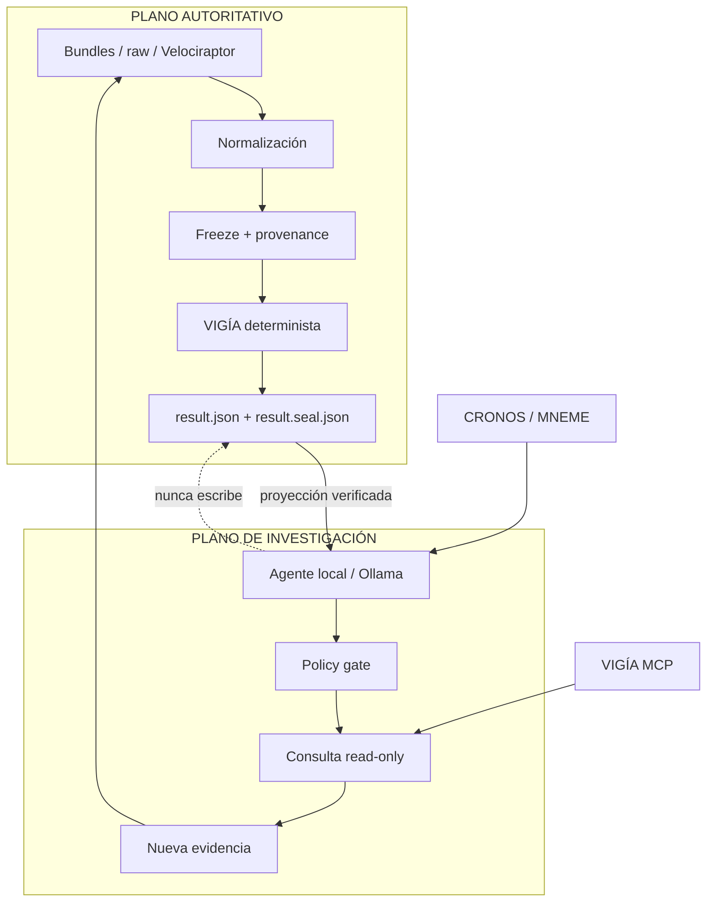

# ZAYNOR

[](https://github.com/annatchijova/zaynor/actions/workflows/ci.yml)
[](./pyproject.toml)
[](https://docs.astral.sh/ruff/)
[](https://black.readthedocs.io/)
[](./LICENSE)
[](https://www.conventionalcommits.org/en/v1.0.0/)
[](./CHANGELOG.md)
[](https://semver.org/spec/v2.0.0.html)

**Investigación forense asistida por IA sin delegarle a la IA la decisión final.**

Investigar un incidente implica reconstruir qué ocurrió a partir de evidencia
incompleta, contradictoria y potencialmente manipulada. Un modelo de IA puede
ayudar mucho: correlacionar artefactos, encontrar inconsistencias, formular
hipótesis y decidir qué conviene investigar después.

Pero un LLM también puede equivocarse.

En DFIR, una respuesta convincente no es evidencia. Una alucinación, una
correlación espuria o una instrucción adversarial escondida dentro de un
artefacto no deberían convertirse en una conclusión forense.

ZAYNOR fue construido alrededor de esa frontera:

> **La IA decide qué investigar. La evidencia verificada decide qué puede afirmarse.**

El modelo local puede investigar, preguntar y explicar. No puede decidir ni
modificar el veredicto. La evidencia pasa por
[VIGÍA](https://github.com/annatchijova/vigia-intent-analysis), un motor
matemático determinista que evalúa hipótesis, contradicciones, causalidad e
incertidumbre mediante un scorer reproducible antes de producir un resultado
verificable.
Si la IA encuentra evidencia nueva, esa evidencia vuelve al sistema antes de
que pueda cambiar la conclusión.

```text
evidencia
   ↓
análisis determinista
   ↓
resultado verificable
   ↓
IA local investiga
   ↓
nueva evidencia
   └──────────────→ análisis nuevamente
```

ZAYNOR funciona localmente y admite evidencia forense estructurada, bundles,
raw evidence, casos postmortem y adquisición acotada con Velociraptor. Incluye
CLI, web, API compatible con OpenAI, Ollama, OpenWebUI y MCP.

**[Probar ZAYNOR en Vercel](https://zaynor-demo.vercel.app) · [Ver un caso reproducible](#caso-reproducible-nitroba) · [Arquitectura ZAYNOR](https://annatchijova.github.io/zaynor/architecture.html) · [Decisiones matemáticas de VIGÍA](https://annatchijova.github.io/vigia/vigia_diagrams.html) · [Instalar](./INSTALL.md)**

*[Read this in English](./README.en.md)*

## No hace falta creerle al README

El pipeline se puede ejecutar end-to-end:

```text
ingesta → freeze → VIGÍA → resultado → seal → audit → report
```

El caso forense NITROBA produce de forma reproducible:

**`SUSPICION` · `AUDIT VERIFIED`**

**[Reproducir NITROBA](#caso-reproducible-nitroba) · [Ver resultado sellado](./frontend/src/lib/api/fixtures/cases/VIGIA-NITROBA-M57-001.json) · [Ver informe PDF](./results/NITROBA.pdf) · [Ver informe MD](./results/NITROBA.md)**

El motor y sus invariantes se ejercitan además sobre el corpus de VIGÍA:
**más de 200 casos independientes**, entre evidencia forense real documentada,
casos maliciosos, benignos, adversariales, BREAK, falsos positivos, formas de
falsos negativos y fixtures de regresión.

## Qué hace concretamente

ZAYNOR reúne tres capacidades que suelen estar separadas:

### Core forense

- ingesta de bundles, raw evidence y evidencia postmortem;
- normalización, provenance y freeze del caso;
- análisis determinista con VIGÍA;
- resultado sellado; audit trail encadenado por hash con timestamps incluidos
  en las entradas hasheadas; cadena de custodia del reporte con
  `result_sha256` determinista y `report_hash` con marca temporal; e informes;
- adquisición local acotada con Velociraptor y observaciones OTel ([demo lab reproducible](./docs/demo-lab/README.md)).

### Investigación asistida

- Ollama local con modelo, host y timeout configurables;
- preguntas y consultas read-only con policy gate;
- tres MCP locales —VIGÍA, CRONOS y MNEME— más el servidor MCP propio;
- hallucination guard para la narración;
- nueva evidencia que vuelve al análisis determinista.

### Interfaces

- CLI para ingestión, freeze, análisis, auditoría, chat y reporting;
- API local compatible con OpenAI;
- OpenWebUI conectado a la API de ZAYNOR;
- web con vistas junior/senior y catálogo de casos;
- reportes MD, HTML y PDF.

## Modelo de autoridad

La arquitectura tiene dos planos:



**Sólo el plano autoritativo puede cambiar el veredicto.** La API y la CLI
verifican `result.json` junto con `result.seal.json` antes de narrar. Ollama
recibe una proyección verificada; el hallucination guard elimina o rechaza
claims contradictorios. La corrección del resultado no depende de la
corrección del LLM.

## Qué significa determinista

VIGÍA no es una caja negra que reemplaza un modelo por reglas simples. El motor
representa propiedades que una narración generativa puede ocultar:

- **Independencia de evidencia:** artefactos dependientes no cuentan como
  corroboración independiente sólo por ser numerosos.
- **Cierre causal:** una hipótesis con una cadena causal incompleta puede no
  sostener un veredicto aunque existan señales fuertes.
- **Decisión acotada por riesgo:** la incertidumbre puede terminar en `ABSTAIN`
  o `UNKNOWN` en lugar de ser rellenada por una inferencia generativa.
- **Aritmética exacta:** la ruta autoritativa no depende de floats ni de una
  probabilidad fabricada por el modelo.

La implementación y sus invariantes están documentadas en
[`docs/technical-details.md`](./docs/technical-details.md), el
[scorer vendorizado](./vendor/vigia_engine/vigia_scorer.py) y los tests de
[aritmética exacta](./tests/test_vigia_scorer_fraction.py).

Referencia visual del motor y sus decisiones matemáticas:
[diagramas publicados de VIGÍA](https://annatchijova.github.io/vigia/vigia_diagrams.html).

## Del evidence al veredicto

El resultado autoritativo no nace de una respuesta generativa. Proviene del
scorer y de las capas matemáticas de VIGÍA.

VIGÍA evalúa la evidencia bajo invariantes explícitos de independencia entre
fuentes, contradicción, provenance, confianza efectiva, coherencia causal,
estabilidad y riesgo de decisión. Las hipótesis compiten con la evidencia
disponible y con explicaciones alternativas; acumular artefactos no aumenta
automáticamente su soporte.

Entre los mecanismos del motor se encuentran:

- **Composición de evidencia y dependencia:** limita la corroboración falsa
  cuando varias observaciones derivan de una misma fuente.
- **Fracturas y contradicciones:** reducen soporte o impiden sostener una
  conclusión cuando la evidencia rompe los supuestos de una hipótesis.
- **Causal Closure Score (CCS):** mide si la cadena causal necesaria está
  suficientemente cerrada; un cierre insuficiente puede imponer abstención.
- **Risk-Bounded Decision Layer:** combina posterior, drift, estabilidad y
  consistencia para conservar una zona explícita de `ABSTAIN`.
- **Confianza efectiva y estabilidad:** separan la fuerza aparente de una
  señal de la estabilidad del razonamiento que la sostiene.
- **Aritmética reproducible:** `Fraction` y `Decimal` se usan donde la ruta
  autoritativa exige resultados exactos y comparables.

El scorer transforma ese estado en una decisión explícita. ZAYNOR conserva
estados como `MALICE`, `SUSPICION`, `BENIGN`, `UNKNOWN` y `ABSTAIN`, junto con
confianza, razones, referencias y material de auditoría.

`ABSTAIN` no significa que el sistema haya fallado: significa que las
condiciones matemáticas para sostener una conclusión no se cumplen. La
incertidumbre se conserva en vez de pedirle al LLM que complete lo que falta.

La especificación, ecuaciones, thresholds e invariantes viven en VIGÍA y en la
documentación técnica; este README resume las propiedades que afectan la
frontera de autoridad.

**Profundizar:** [VIGÍA](https://github.com/annatchijova/vigia-intent-analysis) ·
[`docs/technical-details.md`](./docs/technical-details.md) ·
[scorer](./vendor/vigia_engine/vigia_scorer.py) ·
[tests de aritmética exacta](./tests/test_vigia_scorer_fraction.py)

## Investigación local

El camino de chat es:

```text
OpenWebUI → API ZAYNOR → resultado sellado verificado → Ollama → guard → respuesta segura
```

La API no vuelve a ejecutar VIGÍA desde chat, no acepta un veredicto elegido
por el request y no presenta errores operativos como contenido exitoso del
assistant. MCP aporta capacidades limitadas por rol, recurso y efecto; sus
salidas no tienen autoridad sobre `result.json` ni `result.seal.json`.

Contratos y herramientas: [`docs/mcp-locales.md`](./docs/mcp-locales.md) y
[`docs/adr/0001-separate-mcp-capability-planes.md`](./docs/adr/0001-separate-mcp-capability-planes.md).

## Agentes y capabilities locales

Los agentes locales operan bajo contratos explícitos de capability:
`READ`, `DERIVE`, `ACQUIRE`, `MUTATE` y `AUTHORIZE`, verificados contra
manifests. Ningún agente registrado posee `MUTATE` ni `AUTHORIZE`: puede
consultar, derivar o adquirir evidencia dentro de su policy, pero no modificar
el resultado autoritativo ni autorizar un veredicto.

### Agentes locales (Ollama), por rol

| Rol | Estado | Qué hace de verdad |
|---|---|---|
| **MENTOR** | conectado | Explica un resultado sellado mediante `zaynor chat` / `zaynor serve`; lee `ZaynorAuthoritativeResult` y nunca vuelve a invocar VIGÍA. |
| **CONSULT** | conectado | `zaynor consult`: vista read-only del paquete sellado, sin LLM. |
| **DISPATCHER** | conectado | `zaynor hunts`: catálogo de tipos de evidencia que Mode 1 sabe analizar. |
| **INVESTIGATOR** | implementado, sin caller de producción | `collect_window` / `verify_custody` llaman al bridge MCP de VIGÍA; ningún comando CLI/API los invoca hoy. |
| **FLEET_COMMANDER** | implementado, sin caller de producción | Escribe en el log de investigación; ningún comando lo invoca hoy. |
| **DETECTION_ENGINEER** | implementado, sin caller de producción | `draft_sigma_rule` genera candidatos Sigma anclados a un finding sellado; ningún comando lo invoca hoy. |
| **ENDPOINT_HUNTER / PERSISTENCE_HUNTER** | fuera de alcance | Requerirían recolección en vivo; VIGÍA analiza evidencia congelada. |
| **THREAT_INTEL** | fuera de alcance, por ahora | Existe una implementación portable de VirusTotal/GTI, no incorporada porque implicaría red externa. |

Las capacidades externas están separadas por MCP:

- **VIGÍA MCP:** operaciones forenses acotadas sobre evidencia;
- **CRONOS:** trazas, hipótesis y audit trail de razonamiento;
- **MNEME:** memoria, custodia y verificación de bundles;
- **ZAYNOR MCP:** herramientas case-bound y read-only del proyecto.

Estado detallado y contratos: [`src/zaynor/agents/README.md`](./src/zaynor/agents/README.md),
[`docs/mcp-locales.md`](./docs/mcp-locales.md) y
[`docs/adr/0001-separate-mcp-capability-planes.md`](./docs/adr/0001-separate-mcp-capability-planes.md).

Para ver el laboratorio de adquisición y observabilidad:
[`docs/demo-lab/`](./docs/demo-lab/).

Para auditar o intentar romper estas fronteras:
[`docs/red-team/`](./docs/red-team/).

Para la referencia visual de las decisiones matemáticas:
[diagramas publicados de VIGÍA](https://annatchijova.github.io/vigia/vigia_diagrams.html).

## Caso reproducible: NITROBA

NITROBA es un caso de atribución de identidad sobre captura de red del desafío
M57 Patents / DFRWS 2009. El bundle documenta sesiones Gmail/AIM, cookies,
artefactos de red y explicaciones alternativas.

```text
SOURCE    M57 Patents / DFRWS 2009
INPUT     casos/VIGIA-NITROBA-M57-001.json
FREEZE    manifest + artifact hashes
VIGÍA     SUSPICION
SEAL      result.json + result.seal.json
AUDIT     VERIFIED
OUTPUTS   JSON · MD · HTML · PDF
```

La ejecución completa está en [`GUIA_PERITOS.md`](./GUIA_PERITOS.md). La
secuencia mínima es:

```bash
CASE_FILE="VIGIA-NITROBA-M57-001.json"
CASE_ID="NITROBA"
mkdir -p /tmp/perito-cases /tmp/perito-outputs
echo "{\"caso\": [\"$CASE_FILE\"]}" > /tmp/perito-profile.json

zaynor freeze --case-id "$CASE_ID" --evidence-profile caso \
  --profile-map /tmp/perito-profile.json --source-root casos \
  --cases-root /tmp/perito-cases --json

zaynor analyze --case-id "$CASE_ID" --cases-root /tmp/perito-cases \
  --engine-repo vendor/vigia_engine \
  --output-root /tmp/perito-outputs --json

zaynor audit --case-id "$CASE_ID" --cases-root /tmp/perito-cases \
  --output-root /tmp/perito-outputs --json
```

Después se pueden generar los reportes:

```bash
zaynor report --case-id "$CASE_ID" --output-root /tmp/perito-outputs --format md
zaynor report --case-id "$CASE_ID" --output-root /tmp/perito-outputs --format html
zaynor report --case-id "$CASE_ID" --output-root /tmp/perito-outputs --format pdf
```

## Dataset y provenance

La evaluación reutiliza el corpus público de
[VIGÍA Intent Analysis](https://github.com/annatchijova/vigia-intent-analysis),
con **más de 200 casos independientes** diseñados para evaluar el motor bajo
escenarios forenses, benignos, maliciosos y adversariales.

Incluye:

- casos forenses reales y públicamente documentados;
- casos maliciosos y benignos;
- falsos positivos y formas de falsos negativos;
- casos adversariales;
- casos `BREAK`, diseñados para romper supuestos e invariantes;
- vectores canónicos y fixtures sintéticos de regresión.

El índice de casos y sus fuentes está en [`casos/README.md`](./casos/README.md).
Los manifests conservan dataset, URLs, hashes y notas de provenance cuando
están disponibles. Entre las fuentes públicas documentadas aparecen
[Digital Corpora](https://digitalcorpora.org/) y muestras de memoria de la
[Volatility Foundation](https://github.com/volatilityfoundation/volatility/wiki/Memory-Samples).
VIGÍA también se desarrolló y documentó en el contexto de SANS FIND EVIL; la
provenance concreta de cada artefacto prevalece sobre cualquier etiqueta global.

Los casos locales de ZAYNOR son una selección ejecutable del corpus, no una
redefinición de sus unidades.

## Red team y validación

El repositorio contiene 24 documentos de rondas red-team numeradas o
relacionadas sobre autoridad, CLI, path traversal, TOCTOU, sellos, MCP,
Ollama, OpenWebUI, prompt injection y contratos de agentes.

La última resolución de arquitectura registra el comando que produjo
`362 passed, 1 skipped`. La corrida completa actual no se presenta como un
resultado verde: en este entorno el sandbox bloquea sockets locales usados por
fixtures de Ollama. Una corrida focalizada produjo `44 passed, 3 errors`; esos
errores no se cuentan como tests pasados.

- [Auditoría unificada de seguridad](./docs/red-team/2026-09-17-unified-audit.md)
- [Resolución de la ronda backend](./docs/red-team/2026-09-17-round-22-resolution.md)
- [Resolución de la auditoría de arquitectura](./docs/red-team/2026-09-17-round-23-architecture-audit-resolution.md)
- [Auditoría Ollama/OpenWebUI](./docs/red-team/2026-09-16-round-15-ollama-openwebui.md)
- [Resolución de la ronda 21](./docs/red-team/2026-09-17-round-21-resolution.md)
- [Suite de tests](./tests/)

## Lineage: VIGÍA, ANNACONDA y ZAYNOR

| Línea previa | Qué aporta a ZAYNOR |
|---|---|
| **VIGÍA** | Autoridad determinista, hipótesis, causalidad, provenance, incertidumbre, scoring y abstención. |
| **ANNACONDA** | Adquisición DFIR, adapter Velociraptor, transportes, normalización de rows, evidence windows, window hash, manifest/custody y patrones de investigación agentic. |
| **ZAYNOR** | Contrato común, freeze/seal/audit, trusted boundary, Ollama, MCP, API, CLI, web y loop de reanálisis. |

La reutilización está documentada en [`NOTICE.md`](./NOTICE.md),
[`AGENTS.md`](./AGENTS.md), [`docs/technical-details.md`](./docs/technical-details.md)
y [`src/zaynor/hybrid_integrations.py`](./src/zaynor/hybrid_integrations.py).

## Límites

ZAYNOR no es un SIEM o EDR de monitoreo continuo y no ejecuta remediación
autónoma. Los colectores producen evidencia y provenance; la conclusión sólo
aparece después de freeze y análisis determinista. Las integraciones externas
de threat intelligence son opcionales y no forman parte del runtime local por
defecto.

Para vulnerabilidades, seguir [`SEGURIDAD.md`](./SEGURIDAD.md) y reportar de
forma privada.

## Quickstart

```bash
git clone https://github.com/annatchijova/zaynor.git
cd zaynor
python3 -m venv .venv
source .venv/bin/activate
pip install -e ".[api]"
```

Después, reproducí NITROBA con la secuencia de arriba. Para Ollama, API,
Velociraptor, OpenWebUI y laboratorio, consultá [`INSTALL.md`](./INSTALL.md),
[`GUIA_PERITOS.md`](./GUIA_PERITOS.md) y
[`docs/demo-lab/README.md`](./docs/demo-lab/README.md).

## Seguir leyendo

### Quiero entender el modelo matemático

- [VIGÍA Intent Analysis](https://github.com/annatchijova/vigia-intent-analysis) — motor determinista, scorer, metodología y corpus.
- [`docs/technical-details.md`](./docs/technical-details.md) — cómo ZAYNOR incorpora esa autoridad y la vincula al seal.
- [`vendor/vigia_engine/vigia_scorer.py`](./vendor/vigia_engine/vigia_scorer.py) — scorer utilizado por ZAYNOR.

### Quiero reproducir un análisis forense

- [`GUIA_PERITOS.md`](./GUIA_PERITOS.md) — evidencia, resultado, audit y report.
- [`casos/README.md`](./casos/README.md) — casos, fuentes y provenance.
- [`docs/demo-lab/README.md`](./docs/demo-lab/README.md) — laboratorio reproducible DFIR + AIOps: Velociraptor, OTel, Prometheus/Loki/Tempo/Grafana y pipeline `freeze → VIGÍA → audit`.

### Quiero entender la arquitectura

- [Diagrama interactivo](https://annatchijova.github.io/zaynor/architecture.html)
- [`docs/mcp-locales.md`](./docs/mcp-locales.md)
- [`AGENTS.md`](./AGENTS.md)
- [`docs/adr/0001-separate-mcp-capability-planes.md`](./docs/adr/0001-separate-mcp-capability-planes.md)

### Quiero auditarlo o romperlo

- [`docs/red-team/`](./docs/red-team/)
- [`tests/`](./tests/)
- [`LIMITACIONES_CONOCIDAS.md`](./LIMITACIONES_CONOCIDAS.md)
- [`SEGURIDAD.md`](./SEGURIDAD.md)
- [`CONTRIBUTING.md`](./CONTRIBUTING.md)
- [`AUTHORS.md`](./AUTHORS.md)

## Superficie técnica de ZAYNOR

```text
ZAYNOR
├── Autoridad forense determinista
│   └── VIGÍA
│       ├── razonamiento abductivo e inductivo
│       ├── likelihood + ENFSI
│       ├── cierre causal y estabilidad de grafos
│       ├── decisión acotada por riesgo
│       ├── veredicto cuadripartito
│       ├── aritmética exacta
│       └── scoring determinista
│
├── Adquisición y análisis forense
│   ├── Velociraptor
│   ├── memoria, disco y red
│   ├── MFT, Prefetch, Registry y Shellbags
│   ├── PCAP
│   ├── browser, Android, iOS y macOS
│   ├── reconstrucción de timelines
│   └── normalización de artefactos
│
├── Integridad de evidencia
│   ├── freeze y canonicalización
│   ├── provenance
│   ├── sellos SHA-256
│   ├── audit hash chain ligada al caso
│   ├── timestamps en entradas hasheadas
│   ├── HMAC opcional
│   ├── verificación de custodia
│   └── replay determinista
│
├── Investigación agentic
│   ├── Ollama
│   ├── policy de capabilities: READ / DERIVE / ACQUIRE / MUTATE / AUTHORIZE
│   ├── MENTOR
│   ├── INVESTIGATOR
│   ├── DISPATCHER
│   ├── DETECTION_ENGINEER
│   └── hallucination y authority guards
│
├── MCP
│   ├── VIGÍA
│   ├── CRONOS
│   ├── MNEME
│   └── ZAYNOR MCP
│
├── Observabilidad y laboratorio LIVE
│   ├── OpenTelemetry
│   ├── Prometheus
│   ├── Loki
│   ├── Tempo
│   └── Grafana
│
├── Interfaces
│   ├── CLI
│   ├── API compatible con OpenAI
│   ├── OpenWebUI
│   ├── Web UI
│   └── reportes MD / HTML / PDF
│
└── Verificación
    ├── suite de tests
    ├── corpus adversarial
    ├── rondas Red Team
    ├── tests de determinismo
    ├── tests de autoridad
    └── casos forenses reproducibles
```

### Stack y dependencias principales

```text
Python 3.12
├── ZAYNOR
│   ├── motor VIGÍA vendorizado
│   ├── Ollama
│   ├── MCP
│   ├── Velociraptor
│   └── ReportLab / reporting
├── DFIR
│   └── módulos de análisis estilo SIFT
└── Observabilidad
    └── OpenTelemetry → Prometheus / Loki / Tempo / Grafana

Frontend
└── Next.js / TypeScript → API ZAYNOR
```

El árbol físico completo incluye código fuente, casos, tests, documentación y
artefactos generados. `build/`, caches y dependencias instaladas no forman
parte de la superficie fuente documentada.

## Licencia

Apache License 2.0. Ver [`LICENSE`](./LICENSE).

## Evidencia visual de una corrida CLI

Estas capturas documentan una ejecución local reproducible sobre
`case_026_ventrilocuo_process_hollowing`:

- [Freeze y análisis](./visual/Screenshot%20from%202026-09-18%2004-20-42.png)
- [Resultado autoritativo y sello](./visual/Screenshot%20from%202026-09-18%2004-20-44.png)
- [Audit trail con cadena válida](./visual/Screenshot%20from%202026-09-18%2004-22-41.png)
- [Chat local y guard de autoridad](./visual/Screenshot%20from%202026-09-18%2004-26-12.png)

Lo importante:

- freeze correcto;
- VIGÍA produjo `MALICE`;
- audit: `overall: VERIFIED`;
- audit trail válido: `chain_valid: true`;
- resultado y sello verificados;
- el modelo intentó introducir `UNKNOWN` como veredicto/confianza;
- el hallucination guard lo detectó:
  - `claims_total: 4`;
  - `claims_verified: 3`;
  - `claims_hallucinated: 1`;
  - `suspicious: true`;
  - claim rechazada: `UNKNOWN`.

El veredicto autoritativo siguió siendo `MALICE`.

`confidence: UNKNOWN` en el audit no significa que falló: es un campo del
resultado que no fue calculado o proporcionado para ese fixture.
`provenance: EMPTY` también es una característica de ese fixture, no una
falla de integridad.

La secuencia visible para la demo es:

```text
VIGÍA: MALICE
AUDIT: VERIFIED
CHAIN: VALID
MODEL CLAIM: UNKNOWN
GUARD: REJECTED
AUTHORITATIVE VERDICT: MALICE
```

Esto demuestra que el LLM puede narrar mal, pero no puede cambiar la
autoridad.
