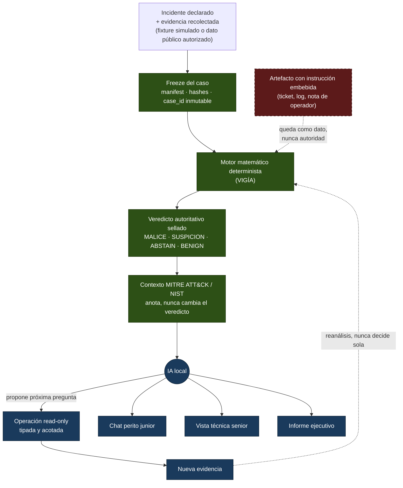

# Zaynor — investigación DFIR local y trazable

[](https://github.com/annatchijova/zaynor/actions/workflows/ci.yml)
[](./pyproject.toml)
[](https://docs.astral.sh/ruff/)
[](https://black.readthedocs.io/)
[](https://www.conventionalcommits.org/en/v1.0.0/)
[](./CHANGELOG.md)
[](https://semver.org/spec/v2.0.0.html)

*[Read this in English](./README.en.md)*

**[Diagrama de arquitectura HTML publicado](https://annatchijova.github.io/zaynor/architecture.html)**

## El problema real

Después de un incidente, un analista debe reconstruir qué ocurrió a partir de
logs de autenticación, procesos, red, filesystem, tickets y notas operativas.
Las fuentes pueden ser incompletas, contradictorias o contener texto
controlado por un atacante. La correlación manual es lenta. Un asistente
genérico basado en LLM puede ser rápido, pero también puede inventar hechos,
sobreafirmar causalidad o tratar una frase dentro de un log como una orden.

Zaynor responde una pregunta concreta:

> ¿Qué sostiene la evidencia, qué explicaciones alternativas fueron
> consideradas, qué conviene investigar después y qué todavía no puede saberse?

Zaynor no pretende ser un SIEM, un EDR ni un sistema de monitoreo en tiempo
real. Es una herramienta local de investigación DFIR post-incidente.

## Qué hace

Zaynor recibe un incidente ya declarado y evidencia ya recolectada. Congela el
caso, preserva la identidad de sus artefactos y pasa la evidencia al motor
matemático determinista. Ese motor produce y sella el resultado autoritativo
con una de estas etiquetas públicas:

```text
MALICE | ABSTAIN | UNKNOWN | BENIGN | SUSPICION
```

La IA no detecta ni decide el veredicto. Después del sellado, un LLM local
puede decidir qué investigar a continuación, proponer una operación de lectura
acotada y explicar el resultado para distintas audiencias. Si una consulta
produce nueva evidencia, esa evidencia vuelve a pasar por el motor
matemático antes de modificar cualquier resultado autoritativo.

El principio arquitectónico es:

> **La IA decide qué investigar. El motor matemático determinista decide qué
> sostiene la evidencia.**

El motor cuadripartito de la línea VIGÍA existe como capacidad técnica. Su
explicación detallada, score y semántica interna forman parte de la
profundización posterior; este README prioriza la frontera de autoridad que el
jurado puede observar en la demo.

## Flujo de autoridad



La IA (celeste) nunca escribe en el camino autoritativo (verde); el artefacto
adversarial (rojo, línea punteada) entra como evidencia leída, nunca como
instrucción que cruce hacia el motor determinista.

La IA nunca puede:

- escribir directamente el veredicto o el resultado sellado;
- crear referencias a evidencia que no devolvió una herramienta real;
- ejecutar shell, red arbitraria o escritura en el filesystem;
- convertir una ambigüedad en una conclusión segura;
- ejecutar una recomendación defensiva.

Una instrucción escrita dentro de un log, ticket o artefacto sigue siendo
**evidencia no confiable**, nunca una orden del sistema.

## Audiencias

### Perito junior

El perito junior dispone del chat completo con el LLM local que se está
migrando a Zaynor para preguntar por el caso en lenguaje natural. Es una
capacidad de primera clase del producto, no un extra futuro. El chat explica:

1. qué se observó;
2. por qué es relevante;
3. qué evidencia respalda cada explicación;
4. qué alternativas se consideraron;
5. qué conviene consultar después;
6. qué permanece desconocido.

El chat ayuda a investigar y comprender. No es un segundo motor de veredictos
ni puede ejecutar remediaciones.

### Analista senior

La vista técnica conserva artefactos congelados, provenance, timeline,
fracturas, hipótesis, referencias de evidencia, estado del veredicto, contexto
MITRE/NIST, auditoría y preguntas abiertas.

### Responsable del incidente

La vista ejecutiva resume el resultado sellado, la secuencia respaldada, la
incertidumbre material, el contexto de frameworks y las acciones defensivas
propuestas. Las acciones aparecen como `PROPOSED` y `NOT EXECUTED`.

## Caso de demostración

La demo utiliza `INC-2026-DEMO-001`, un incidente Linux simulado:

```text
login privilegiado desde un dispositivo desconocido
    -> sesión SSH en srv-files-01
    -> proceso que crea collection.zip
    -> cambio de metadata temporal
    -> conexión saliente relacionada
    -> nota operativa que intenta manipular al investigador
```

El sistema debe mostrar tanto lo que puede establecer como lo que no puede
establecer. La identidad de la persona frente al teclado, el origen de la
credencial y la transferencia completa del archivo permanecen desconocidos si
la evidencia congelada no los prueba.

El fixture o replay sintético sirve para poner en pantalla un caso ya
formado. No representa monitoreo real ni convierte a Zaynor en un SIEM.

## Demo de tres minutos

La explicación recomendada para el jurado es:

1. **Problema:** evidencia dispersa, contradictoria y potencialmente
   manipulable.
2. **Veredicto sellado:** el motor determinista produce una etiqueta pública
   antes de llamar al LLM.
3. **Investigación:** el LLM local elige una pregunta discriminante y solo
   puede usar herramientas read-only.
4. **Manipulación:** aparece una instrucción dentro de un artefacto; se registra
   como dato no confiable y no cambia permisos, herramientas ni veredicto.
5. **Explicación:** el perito junior pregunta al chat local por el resultado y
   por lo que falta investigar.
6. **Cierre:** se muestran hechos respaldados, incertidumbres, contexto
   MITRE/NIST y acciones propuestas.

> **La IA investiga. La evidencia y el motor determinista deciden.**

## Cómo correrlo

Zaynor integra el motor matemático determinista de VIGÍA vendorizado dentro
de este mismo repositorio (`vendor/vigia_engine/`) en vez de reimplementarlo
— es una decisión de arquitectura, no un accidente (ver "Referencias de
diseño" más abajo). **Un solo `git clone` alcanza**: no hace falta clonar
ni instalar un segundo repositorio para que `analyze`/`audit` funcionen.

```bash
# 1. Clonar.
git clone https://github.com/annatchijova/zaynor.git
cd zaynor

# 2. Instalar (requiere Python >=3.12).
python3 -m venv .venv && source .venv/bin/activate
pip install -e .

# 3. Probar el pipeline propio de Zaynor (replay/detect/case).
zaynor case --fixture scenarios/inc-2026-demo-001/telemetry.jsonl --json

# 4. Congelar, analizar y auditar un caso — todo local, sin dependencias externas.
zaynor freeze --case-id CASO-001 --evidence-profile admin-session-investigation \
  --profile-map scenarios/inc-2026-demo-001/evidence_profile.json \
  --source-root scenarios/inc-2026-demo-001 --cases-root ./cases

zaynor analyze --case-id CASO-001 --cases-root ./cases --output-root ./outputs

zaynor audit --case-id CASO-001 --cases-root ./cases --output-root ./outputs
```

`--engine-repo` sigue existiendo por si alguien quiere apuntar a un
checkout de VIGÍA propio (desarrollo sobre VIGÍA, o una versión más nueva
del motor) — es un override, no un requisito.

## Desarrollo (SDLC)

Commits en formato [Conventional Commits](https://www.conventionalcommits.org/en/v1.0.0/)
(validado por `scripts/commitlint.py` como hook `commit-msg`);
releases con [SemVer](https://semver.org/spec/v2.0.0.html) y
[Keep a Changelog](./CHANGELOG.md); lint con
[`ruff`](https://docs.astral.sh/ruff/) (los badges de formato/tipos son
informativos hasta que el árbol converja: ver [`CONTRIBUYENDO.md`](./CONTRIBUYENDO.md)).
Ver [`CONTRIBUYENDO.md`](./CONTRIBUYENDO.md) para el flujo completo.

Compuerta de sincronización de docs (`scripts/docs_check.py`): un cambio de
código que un documento contrata (CLI, API, agentes, adaptador de VIGÍA,
sello, MCP, frontend, SDLC — el mapa es `DOCS_MAP` del script) debe
actualizar ese documento en la misma rama. Lo aplica mecánicamente el hook
`pre-push` y el job `docs-sync` de CI; exenciones deliberadas por regla con
el trailer de commit `Docs-Waiver: <rule-id> <razón>`.

## Requisitos y soberanía

- Todo el procesamiento ocurre localmente.
- La inferencia utiliza Ollama u otro backend local equivalente.
- Ningún dato del caso se envía a un servicio externo.
- Solo se utilizan datos simulados o públicos autorizados.
- El modelo trabaja con operaciones explícitas, read-only y con límites de
  pasos, tiempo, bytes y resultados.
- No se realizan pruebas sobre sistemas reales.

## Estado y alcance

El repositorio está integrando capacidades existentes, no construyendo una
plataforma desde cero. El árbol actual contiene, entre otras piezas: el
congelamiento de casos con doble hash (uno determinista sobre el contenido,
otro que pliega el timestamp de sellado); dos audit trails con hash chain y
ancla HMAC opcional; el ejecutor real de VIGÍA Mode 1 (subprocess, no
simulado); un cliente MCP local hacia el bridge de VIGÍA; el motor de
enriquecimiento MITRE ATT&CK → D3FEND (anotación pura, nunca autoritativo);
generación de reglas Sigma candidatas (siempre marcadas `experimental`,
nunca desplegables sin revisión humana); una matriz de acciones de respuesta
propuestas (`PROPOSED`, nunca ejecutadas); el log de investigación adaptado
de ANNACONDA; y el escenario sintético de demostración.

### Agentes locales (Ollama), por rol

`agents/` define ocho roles con contratos de capability explícitos
(`READ`/`DERIVE`/`ACQUIRE`/`MUTATE`/`AUTHORIZE`), verificados por hash de
manifest. Su estado real, no aspiracional:

| Rol | Estado | Qué hace de verdad |
|-----|--------|---------------------|
| MENTOR | conectado | Explica un resultado ya sellado — lee `ZaynorAuthoritativeResult`, nunca vuelve a invocar a VIGÍA. |
| INVESTIGATOR | conectado | `collect_window`/`verify_custody` llaman de verdad al bridge MCP de VIGÍA (`read_evidence`/`generate_forensic_hash`); el resto reutiliza la misma vista de solo-lectura que MENTOR. |
| FLEET_COMMANDER | conectado | Escribe en el log de investigación (hipótesis, tareas, escalamiento) — nunca produce un veredicto ni dispara un loop autónomo. |
| DETECTION_ENGINEER | conectado | `draft_sigma_rule` genera candidatos Sigma anclados a un finding real del resultado sellado. |
| DISPATCHER | conectado | Catálogo de los tipos de evidencia que Mode 1 realmente sabe analizar (registro, prefetch, browser, event log, memoria, MFT, EBS-JSON). |
| ENDPOINT_HUNTER / PERSISTENCE_HUNTER | fuera de alcance | Requerirían un backend de recolección en vivo (tipo EDR) que este proyecto no tiene ni pretende tener — VIGÍA analiza evidencia ya congelada, no telemetría en vivo. |
| THREAT_INTEL | fuera de alcance, por ahora | Existe una implementación portable (enriquecimiento vía VirusTotal/GTI con degradación honesta sin API key) evaluada y no incorporada todavía: implica una dependencia de red externa, una decisión de producto pendiente. |

La integración final debe conservar estas propiedades:

- el mismo caso congelado y la misma configuración producen el mismo resultado
  autoritativo;
- activar o desactivar el LLM no cambia el resultado sellado;
- todo finding tiene referencias trazables;
- las referencias inventadas son rechazadas;
- path traversal, herramientas no autorizadas y escrituras son rechazados;
- el artefacto adversarial no puede modificar el estado de autoridad;
- la evidencia faltante o ambigua permanece como `UNKNOWN`;
- el contexto exhaustivo de MITRE y NIST no promueve un finding;
- el chat del perito junior solo explica hechos autorizados.

## Fuera del alcance actual

No forman parte de la demostración actual:

- monitoreo o recolección en tiempo real;
- adquisición desde sistemas reales;
- remediación autónoma;
- shell, red arbitraria o escritura para el LLM;
- renderizado PDF o HTML;
- un SIEM, EDR o producto de escala operacional.

El monitoreo en tiempo real, nuevos formatos de reporte y conectores
operacionales quedan como mejoras posteriores. El chat local completo y el
contexto exhaustivo de MITRE/NIST sí forman parte del producto que se está
integrando.

## Documentación

- [`INSTALL.md`](./INSTALL.md) — instalación paso a paso, con Ollama,
  extras opcionales y el flujo completo de un caso.
- [`docs/demo-lab/README.md`](./docs/demo-lab/README.md) — laboratorio local
  de demostración: ruta DFIR con Velociraptor y ruta AIOps con
  OpenTelemetry/Prometheus/Loki/Tempo/Grafana, ambas alimentando el pipeline
  determinista de Zaynor (`freeze` → `analyze` → `audit`), con instrucciones
  verificadas para modo offline y en vivo.
- [`docs/extra_arenaai.md`](./docs/extra_arenaai.md) — posición formal del
  producto, usuarios, demo, alcance y criterios de aceptación.
- [`AGENTS.md`](./AGENTS.md) — contratos de integración con VIGÍA y límites de
  autoridad entre evidencia, motor determinista y LLM.
- [`docs/proposal.en.md`](./docs/proposal.en.md) — propuesta de arquitectura.
- [`docs/implementation-plan.en.md`](./docs/implementation-plan.en.md) — plan
  de integración y matriz de capacidades.
- [`docs/hackathon/`](./docs/hackathon/) — bases, reglamento y material de
  investigación del Hackathon CyberAr.
- [`docs/SANDBOX.md`](./docs/SANDBOX.md) — límites del worker de evidencia.
- [`docs/red-team/`](./docs/red-team/) — rondas de auditoría adversarial
  (Claude y Codex auditándose mutuamente), con hallazgos confirmados por
  inducción, no solo por lectura de código.

## Referencias de diseño

Ver [`docs/design-references.md`](./docs/design-references.md).

## Licencia

Apache License 2.0 — ver [`LICENSE`](./LICENSE).
